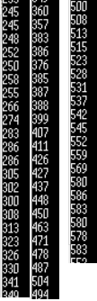

# STM32 

## 목차


## printf()

디버깅을 위해서 출력은 필수이다.

하지만 기본적으로 ST사에서 제공하는 STM32CubeIDE에선 기능이 없다.

따라서 1학기 처럼 USB uart device를 통해 확인을 하기도 했다.
다만, 현재 USB uart device가 없으므로 다른 방안을 찾아야 했다.

[참고자료] https://forum.digikey.com/t/stm32-printf/31174

[준비물] Tera Term
기본적으로 ST보드의 경우 uart1을 자동 on해놓음

<stdio.h>를 통해 printf()를 하면 주변 기기(uart 또는 usart)로 문자열을 전송함.
현재 ST-link(혹은 USB COM포트의 가상 ST-Link)과 연결된 시리얼을 통해 uart를 생성함
따라서 시리얼 모니터(tera term)로 출력을 확인한다.

[다음과 같은 진행을 한다]
- 프로젝트를 생성한다.

- device configuration tool(MX아이콘)을 누른다.

- 좌측 하단에 USART_TX와 USART_RX가 초록색으로 활성화 된 것이 보인다.

- Connectivity에서 USART2를 선택한다.

- Parameter Settings에서 baud rate와 Paraty, Stop Bits, Word Length를 확인한다.(향후 tera term 설정시 같게 해주어야 함)

- 이제 코드를 generate시킨다.

- main.c에서 
```
/* USER CODE BEGIN Includes */
#include<stdio.h>
/* USER CODE END Includes */

(중략)


/* USER CODE BEGIN PFP */
#ifdef __GNUC__
#define PUTCHAR_PROTOTYPE int __io_putchar(int ch)
#else
#define PUTCHAR_PROTOTYPE int fputc(int ch, FILE *f)
#endif

PUTCHAR_PROTOTYPE
{
  HAL_UART_Transmit(&huart2, (uint8_t *)&ch, 1, HAL_MAX_DELAY);
  return ch;
}
/* USER CODE END PFP */

(중략)

  /* USER CODE BEGIN WHILE */
  while (1)
  {

    /* USER CODE END WHILE */

    /* USER CODE BEGIN 3 */
	  printf("hello\r\n");
	  HAL_Delay(500);
  }
  /* USER CODE END 3 */


```

- 이제 tera term에서 사진과 같이 진행한다.

ST보드와 연결된 포트를 선택한다.


Setup > Serial Port

아까 Parameter Settings에서 확인한 세팅으로 바꾼다. 


결과


## 초음파 센서 작동
들어가기 앞서 초음파 센서 작동원리에 대해 의견이 달라서 정리하였다.
- Trigger로 부터 초음파를 발사하는 시점부터 Echo로 초음파가 들어오는 시점의 시간
- Trigger로 부터 초음파를 발사하고, Echo로 초음파가 들어오기 시작하는 시점부터 더 이상 초음파가 들어오지 않는 시점의 시간

본인(김영래)은 첫번째 방식을 생각하고 진행하였다.

기존 코드(printf()까지)에서 이어서 시작한다.

```

(중략)

/* USER CODE BEGIN 0 */

// Tick을 설정하는 함수 1tick == (1 / 숫자)를 의미한다.
HAL_StatusTypeDef HAL_InitTick(uint32_t TickPriority) {
	  if (HAL_SYSTICK_Config(HAL_RCC_GetHCLKFreq() / 100000) == 0) {
		  printf("HAL_OK\r\n");
	    return HAL_OK;
	  } else {
		  printf("HAL_ERROR\r\n");
	    return HAL_ERROR;
	}
}


/* USER CODE END 0 */


(중략)


/* USER CODE BEGIN 1 */

if (HAL_InitTick(TICK_INT_PRIORITY) != HAL_OK) {
	Error_Handler();
}
/* USER CODE END 1 */


(중략)


/* USER CODE BEGIN WHILE */
  uint32_t st;
  uint32_t ed;
  uint32_t diff;
  uint32_t distance;


  while (1)
  {
    /* USER CODE END WHILE */

    /* USER CODE BEGIN 3 */

    // GPIO를 쓰거나 읽는 방법 예시
	  //HAL_GPIO_WritePin(GPIOA, GPIO_PIN_8, SET);
	  // HAL_GPIO_ReadPin(GPIOA, GPIO_PIN_9)==GPIO_PIN_SET


	  HAL_GPIO_WritePin(GPIOA, GPIO_PIN_8, RESET);
	  HAL_Delay(5);
	  HAL_GPIO_WritePin(GPIOA, GPIO_PIN_8, SET);
	  HAL_Delay(20);
	  HAL_GPIO_WritePin(GPIOA, GPIO_PIN_8, RESET);

	  //printf("right after : %lu\r\n", HAL_GPIO_ReadPin(GPIOA, GPIO_PIN_9));
	  st = HAL_GetTick();
	  while(HAL_GPIO_ReadPin(GPIOA, GPIO_PIN_9)==GPIO_PIN_RESET);
	  while(HAL_GPIO_ReadPin(GPIOA, GPIO_PIN_9)==GPIO_PIN_SET);
	  ed = HAL_GetTick();

	  diff = ed -st;
	  distance = diff * 0.034 / 2;
	  printf("%lu\r\n", diff);

	  //printf("%lu \r\n", micros());
	  HAL_Delay(100000);

  }
  /* USER CODE END 3 */


```

### 새로운 함수
일단 새로운 함수들 부터 설명을 하겠다.
- HAL_GPIO_WritePin(GPIO_PORT, GPIO_PIN_NUMBER, SETTING)
해당하는 GPIO을 다시 설정한다.
GPIO_PORT는 GPIO의 포트를 의미하며 해당 보드(STM32F103RB)에선 A부터 C까지 있는것으로 핀맵에 나타난다.
다음과 같이 넣는다. GPIOA 또는 GPIOB ... GPIOx로 부터 shift한 주소를 가진다.
GPIO_PIN_NUMBER는 각 포트마다 PIN이 1-10이 있다.
Setting은 GPIO를 어떻게 설정할지를 결정한다. SET은 ON 또는 HIGH또는 1로 // RESET은 OFF 또는 LOW 또는 0으로 설정한다.

- HAL_GPIO_ReadPin(GPIO_PORT, GPIO_PIN_NUMBER)
해당하는 GPIO의 값을 읽는다.
return값으로 GPIO_PIN_RESET(0)과 GPIO_PIN_SET(1)이 있다.

- HAL_GetTick()
현재 Tick값을 가져온다. 
Tick이란 시스템에 있어서 시간 단위이며, 아래 함수로 부터 설정된 시간(오실레이터의 진동)마다 Tick Interrupt가 발생된다.
이때, Tick++ 한다. 

- HAL_InitTick(TICK_INT_PRIORITY)
Tick Interrupt의 주기를 설정한다. 

```

HAL_StatusTypeDef HAL_InitTick(uint32_t TickPriority) {
	  if (HAL_SYSTICK_Config(HAL_RCC_GetHCLKFreq() / 100000) == 0) {
		  printf("HAL_OK\r\n");
	    return HAL_OK;
	  } else {
		  printf("HAL_ERROR\r\n");
	    return HAL_ERROR;
	}
}

```

위 코드는 함수를 재 정의한 것이다.
저기서 숫자(100000)의 값을 바꾸면 Tick Interrupt의 주기가 바뀐다.
1000이 기본값이며, 1/1000초 마다 TIck Interrupt가 발생한다.
10000이면 1/10000초 마다 TIck Interrupt가 발생한다.

즉, 값이 클수록 1초동안 TIck의 값이 더 크게 증가한다.

[중요한 점]
또한 Tick을 기준으로 delay하는 HAL_Delay()도 Tick Interrupt주기에 따라 값을 다르게 넣어줘야한다.

### 함수를 통한 코드
/* USER CODE BEGIN WHILE */ 부터  /* USER CODE END 3 */ 까지

```

HAL_GPIO_WritePin(GPIOA, GPIO_PIN_8, RESET);
HAL_Delay(5);
HAL_GPIO_WritePin(GPIOA, GPIO_PIN_8, SET);
HAL_Delay(20);
HAL_GPIO_WritePin(GPIOA, GPIO_PIN_8, RESET);

```

Trigger로 부터 초음파를 20 Tick동안 쏜다.


```

st = HAL_GetTick();
while(HAL_GPIO_ReadPin(GPIOA, GPIO_PIN_9)==GPIO_PIN_RESET);
while(HAL_GPIO_ReadPin(GPIOA, GPIO_PIN_9)==GPIO_PIN_SET);
ed = HAL_GetTick();

```

받고 끝날때 까지의 시간을 기록한다.

```

diff = ed -st;
distance = diff * 0.034 / 2;
printf("%lu\r\n", diff);


```

차이를 출력한다.
여기서 diff는 음파가 340/ms이고 왔다가 다시 돌아오기에 /2다.


### 초음파 결론
HAL_StatusTypeDef HAL_InitTick(uint32_t TickPriority) {
	  if (HAL_SYSTICK_Config(HAL_RCC_GetHCLKFreq() / 1000) == 0) {
	    return HAL_OK;
	  } else {
	    return HAL_ERROR;
	}
}

로 세팅하면 diff가 2 3 4 5로 나타난다.

HAL_StatusTypeDef HAL_InitTick(uint32_t TickPriority) {
	  if (HAL_SYSTICK_Config(HAL_RCC_GetHCLKFreq() / 10000) == 0) {
	    return HAL_OK;
	  } else {
	    return HAL_ERROR;
	}
}

로 세팅하면 diff가 20 21 22 ~ 48 49 50 ...
로 10배 더 세분화된다.

1000000부터는 불가능(1us) -> 1MHz
72 MHz maximum frequency이며, 현재 내부 클럭을 HSI로 하여 8MHz임
즉 8클럭 안에 SysTick Handler를 수행해야함 <- 불가능
10us(100000)도 위험할지도 모름, 80클럭 안에 SysTick Handler는 수행이 가능하겠지만,
점점 더 늘어날 코드를 고려한다면, 함수화 시켜서 가능할지도 모름.


<br>
100us


<br>
10us
