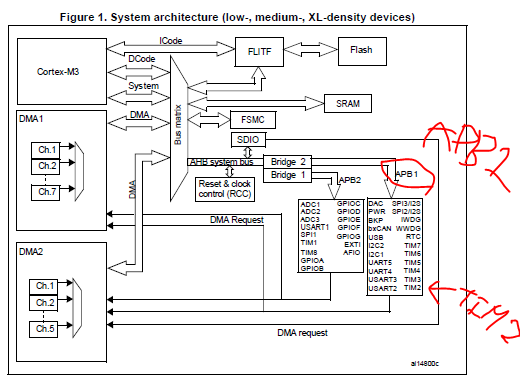

# STM32 

## 목차

<br><br>

## printf()

디버깅을 위해서 출력은 필수이다.

하지만 기본적으로 ST사에서 제공하는 STM32CubeIDE에선 기능이 없다.

따라서 1학기 처럼 USB uart device를 통해 확인을 하기도 했다.
다만, 현재 USB uart device가 없으므로 다른 방안을 찾아야 했다.

[참고자료] https://forum.digikey.com/t/stm32-printf/31174

[준비물] Tera Term
기본적으로 ST보드의 경우 uart1을 자동 on해놓음

<stdio.h>를 통해 printf()를 하면 주변 기기(uart 또는 usart)로 문자열을 전송함.
현재 ST-link(혹은 USB COM포트의 가상 ST-Link)과 연결된 시리얼을 통해 uart를 생성함
따라서 시리얼 모니터(tera term)로 출력을 확인한다.

[다음과 같은 진행을 한다]
- 프로젝트를 생성한다.

- device configuration tool(MX아이콘)을 누른다.

- 좌측 하단에 USART_TX와 USART_RX가 초록색으로 활성화 된 것이 보인다.

- Connectivity에서 USART2를 선택한다.

- Parameter Settings에서 baud rate와 Paraty, Stop Bits, Word Length를 확인한다.(향후 tera term 설정시 같게 해주어야 함)

- 이제 코드를 generate시킨다.

- main.c에서 
```
/* USER CODE BEGIN Includes */
#include<stdio.h>
/* USER CODE END Includes */

(중략)


/* USER CODE BEGIN PFP */
#ifdef __GNUC__
#define PUTCHAR_PROTOTYPE int __io_putchar(int ch)
#else
#define PUTCHAR_PROTOTYPE int fputc(int ch, FILE *f)
#endif

PUTCHAR_PROTOTYPE
{
  HAL_UART_Transmit(&huart2, (uint8_t *)&ch, 1, HAL_MAX_DELAY);
  return ch;
}
/* USER CODE END PFP */

(중략)

  /* USER CODE BEGIN WHILE */
  while (1)
  {

    /* USER CODE END WHILE */

    /* USER CODE BEGIN 3 */
	  printf("hello\r\n");
	  HAL_Delay(500);
  }
  /* USER CODE END 3 */


```

- 이제 tera term에서 사진과 같이 진행한다.

ST보드와 연결된 포트를 선택한다.


Setup > Serial Port

아까 Parameter Settings에서 확인한 세팅으로 바꾼다. 


결과


<br><br><br>

## 펌웨어 단에서 모터 제어하기

<br>


### 구성 환경
- Board  : STM32F103RB
- IDE : STM32CubeIDE
- peripherals : MG996R servo motor

<br>

### 개요
경험의 가치를 포함하며, 단가가 8만원(model-B 4GB기준) 라즈베리파이가 아닌 2만원 stm보드를 사용하기로 정했습니다.

기존의 라즈베리파이를 이용한 servo motor의 제어는 파이썬에서 라이브러리를 통해 원하는 각도를 입력하면 되는 방식이지만, stm보드는 직접 세팅하고 만들어야한다.

<br>

### 과정
servo motor의 제어를 위해선 PWM신호를 입력으로 주어야 한다.

MG996R datasheet를 읽고
이때 신호는 주기 20ms이며, 1~2ms의 duty cycle로 0~180도의 동작한다는 것을 알았다. 


stm32F103RB의 경우, 위 사진처럼 PWM신호는 TIM로 발생시킨다. 신호를 generate를 위한 시스템 클럭과 분주기들의 설정 시킨다.

일단 TIM2를 PWM신호 발생 타이머로 선택했다. 
TIM2는 아래 이미지와 같이 APB1의 클럭을 기준으로 하는걸 알 수 있다.




마찬가지로 TIM 레지스터의 config도 GUI를 통해 설정한다


이러면 8Mhz / (16 * 10000) = 50Hz가 된다. 50Hz == 20ms


출처 : rm0008 - stm32F103 reference manual

<br>

### 코드
config를 통해 generate된 주소명과 API를 이용하여 모터를 제어한다.

'''
HAL_TIM_PWM_Start(&htim2,TIM_CHANNEL_1);
'''

타이머를 PWM용으로 시작한다.

__HAL_TIM_SET_COMPARE(&htim2, TIM_CHANNEL_1, 500);

HAL_Delay(500);

__HAL_TIM_SET_COMPARE(&htim2, TIM_CHANNEL_1, 750);

HAL_Delay(500);

__HAL_TIM_SET_COMPARE(&htim2, TIM_CHANNEL_1, 1000);

HAL_Delay(500);

이떄 500은 10000을 20ms라 할때, 1ms를 의미한다. 마찬가지로 1000은 2ms를 의미한다

<br>

### 결과
예상한 각도는 0도 90도 180도로 움직일거라 생각했지만,
결과는 0도 45도 90도로 나왔다.

어디서 계산이 잘못된건지 더 공부해 봐야할거 같다.

<br><br><br><br>

## 초음파 센서 작동
들어가기 앞서 초음파 센서 작동원리에 대해 의견이 달라서 정리하였다.
- Trigger로 부터 초음파를 발사하는 시점부터 Echo로 초음파가 들어오는 시점의 시간
- Trigger로 부터 초음파를 발사하고, Echo로 초음파가 들어오기 시작하는 시점부터 더 이상 초음파가 들어오지 않는 시점의 시간

본인(김영래)은 첫번째 방식을 생각하고 진행하였다.

기존 코드(printf()까지)에서 이어서 시작한다.

```

(중략)

/* USER CODE BEGIN 0 */

// Tick을 설정하는 함수 1tick == (1 / 숫자)를 의미한다.
HAL_StatusTypeDef HAL_InitTick(uint32_t TickPriority) {
	  if (HAL_SYSTICK_Config(HAL_RCC_GetHCLKFreq() / 100000) == 0) {
		  printf("HAL_OK\r\n");
	    return HAL_OK;
	  } else {
		  printf("HAL_ERROR\r\n");
	    return HAL_ERROR;
	}
}


/* USER CODE END 0 */


(중략)


/* USER CODE BEGIN 1 */

if (HAL_InitTick(TICK_INT_PRIORITY) != HAL_OK) {
	Error_Handler();
}
/* USER CODE END 1 */


(중략)


/* USER CODE BEGIN WHILE */
  uint32_t st;
  uint32_t ed;
  uint32_t diff;
  uint32_t distance;


  while (1)
  {
    /* USER CODE END WHILE */

    /* USER CODE BEGIN 3 */

    // GPIO를 쓰거나 읽는 방법 예시
	  //HAL_GPIO_WritePin(GPIOA, GPIO_PIN_8, SET);
	  // HAL_GPIO_ReadPin(GPIOA, GPIO_PIN_9)==GPIO_PIN_SET


	  HAL_GPIO_WritePin(GPIOA, GPIO_PIN_8, RESET);
	  HAL_Delay(5);
	  HAL_GPIO_WritePin(GPIOA, GPIO_PIN_8, SET);
	  HAL_Delay(20);
	  HAL_GPIO_WritePin(GPIOA, GPIO_PIN_8, RESET);

	  //printf("right after : %lu\r\n", HAL_GPIO_ReadPin(GPIOA, GPIO_PIN_9));
	  st = HAL_GetTick();
	  while(HAL_GPIO_ReadPin(GPIOA, GPIO_PIN_9)==GPIO_PIN_RESET);
	  while(HAL_GPIO_ReadPin(GPIOA, GPIO_PIN_9)==GPIO_PIN_SET);
	  ed = HAL_GetTick();

	  diff = ed -st;
	  distance = diff * 0.034 / 2;
	  printf("%lu\r\n", diff);

	  //printf("%lu \r\n", micros());
	  HAL_Delay(100000);

  }
  /* USER CODE END 3 */


```

### 새로운 함수
일단 새로운 함수들 부터 설명을 하겠다.
- HAL_GPIO_WritePin(GPIO_PORT, GPIO_PIN_NUMBER, SETTING)
해당하는 GPIO을 다시 설정한다.
GPIO_PORT는 GPIO의 포트를 의미하며 해당 보드(STM32F103RB)에선 A부터 C까지 있는것으로 핀맵에 나타난다.
다음과 같이 넣는다. GPIOA 또는 GPIOB ... GPIOx로 부터 shift한 주소를 가진다.
GPIO_PIN_NUMBER는 각 포트마다 PIN이 1-10이 있다.
Setting은 GPIO를 어떻게 설정할지를 결정한다. SET은 ON 또는 HIGH또는 1로 // RESET은 OFF 또는 LOW 또는 0으로 설정한다.

- HAL_GPIO_ReadPin(GPIO_PORT, GPIO_PIN_NUMBER)
해당하는 GPIO의 값을 읽는다.
return값으로 GPIO_PIN_RESET(0)과 GPIO_PIN_SET(1)이 있다.

- HAL_GetTick()
현재 Tick값을 가져온다. 
Tick이란 시스템에 있어서 시간 단위이며, 아래 함수로 부터 설정된 시간(오실레이터의 진동)마다 Tick Interrupt가 발생된다.
이때, Tick++ 한다. 

- HAL_InitTick(TICK_INT_PRIORITY)
Tick Interrupt의 주기를 설정한다. 

```

HAL_StatusTypeDef HAL_InitTick(uint32_t TickPriority) {
	  if (HAL_SYSTICK_Config(HAL_RCC_GetHCLKFreq() / 100000) == 0) {
		  printf("HAL_OK\r\n");
	    return HAL_OK;
	  } else {
		  printf("HAL_ERROR\r\n");
	    return HAL_ERROR;
	}
}

```

위 코드는 함수를 재 정의한 것이다.
저기서 숫자(100000)의 값을 바꾸면 Tick Interrupt의 주기가 바뀐다.
1000이 기본값이며, 1/1000초 마다 TIck Interrupt가 발생한다.
10000이면 1/10000초 마다 TIck Interrupt가 발생한다.

즉, 값이 클수록 1초동안 TIck의 값이 더 크게 증가한다.

[중요한 점]
또한 Tick을 기준으로 delay하는 HAL_Delay()도 Tick Interrupt주기에 따라 값을 다르게 넣어줘야한다.

### 함수를 통한 코드
/* USER CODE BEGIN WHILE */ 부터  /* USER CODE END 3 */ 까지

```

HAL_GPIO_WritePin(GPIOA, GPIO_PIN_8, RESET);
HAL_Delay(5);
HAL_GPIO_WritePin(GPIOA, GPIO_PIN_8, SET);
HAL_Delay(20);
HAL_GPIO_WritePin(GPIOA, GPIO_PIN_8, RESET);

```

Trigger로 부터 초음파를 20 Tick동안 쏜다.


```

st = HAL_GetTick();
while(HAL_GPIO_ReadPin(GPIOA, GPIO_PIN_9)==GPIO_PIN_RESET);
while(HAL_GPIO_ReadPin(GPIOA, GPIO_PIN_9)==GPIO_PIN_SET);
ed = HAL_GetTick();

```

받고 끝날때 까지의 시간을 기록한다.

```

diff = ed -st;
distance = diff * 0.034 / 2;
printf("%lu\r\n", diff);


```

차이를 출력한다.
여기서 diff는 음파가 340/ms이고 왔다가 다시 돌아오기에 /2다.


### 초음파 결론
HAL_StatusTypeDef HAL_InitTick(uint32_t TickPriority) {
	  if (HAL_SYSTICK_Config(HAL_RCC_GetHCLKFreq() / 1000) == 0) {
	    return HAL_OK;
	  } else {
	    return HAL_ERROR;
	}
}

로 세팅하면 diff가 2 3 4 5로 나타난다.

HAL_StatusTypeDef HAL_InitTick(uint32_t TickPriority) {
	  if (HAL_SYSTICK_Config(HAL_RCC_GetHCLKFreq() / 10000) == 0) {
	    return HAL_OK;
	  } else {
	    return HAL_ERROR;
	}
}

로 세팅하면 diff가 20 21 22 ~ 48 49 50 ...
로 10배 더 세분화된다.

1000000부터는 불가능(1us) -> 1MHz
72 MHz maximum frequency이며, 현재 내부 클럭을 HSI로 하여 8MHz임
즉 8클럭 안에 SysTick Handler를 수행해야함 <- 불가능
10us(100000)도 위험할지도 모름, 80클럭 안에 SysTick Handler는 수행이 가능하겠지만,
점점 더 늘어날 코드를 고려한다면, 함수화 시켜서 가능할지도 모름.


<br>
100us


<br>
10us


 


<br>


 ## 타이머

TIM1을 기준으로 작성함. (8MHz)

 TIM1을 선택함.

 Clock Source를 Internal Clock으로 선택함

 NVIC에서 TIM1 upgrade interrupt와 TIM1 capture compare interrupt를 체크한다.

 코드 제네레이트하자


 ```
/* USER CODE END PM */

/* Private variables ---------------------------------------------------------*/
TIM_HandleTypeDef htim1; // tim.h에 있을 수 도 있음

UART_HandleTypeDef huart2; // uart.h에 있을 수 도 있음

/* USER CODE BEGIN PV */
/* USER CODE END PV */

/* Private function prototypes -----------------------------------------------*/
void SystemClock_Config(void);
static void MX_GPIO_Init(void);
static void MX_USART2_UART_Init(void);
static void MX_TIM1_Init(void);

(중략)

/* Private user code ---------------------------------------------------------*/


 /* USER CODE BEGIN 0 */

uint32_t overflows = 0U;

void HAL_TIM_PeriodElapsedCallback(TIM_HandleTypeDef *htim) { // 제네레이트 없음
	if(htim->Instance == TIM1) {
		overflows++;
	}
}


uint32_t GetMicroSec(void){ // 제네레이트 없음
	uint32_t count = __HAL_TIM_GET_COUNTER(&htim1);
	uint32_t overflow = overflows;
	if (__HAL_TIM_GET_FLAG(&htim1, TIM_FLAG_UPDATE) && (count < 0x8000)) {
	        overflow++;
	}

	return(overflow << 16) + count;
}

/* USER CODE END 0 */


(중략)

/* USER CODE BEGIN WHILE */
  HAL_TIM_Base_Init(&htim1);         // 제네레이트 없음
  __HAL_TIM_SET_COUNTER(&htim1, 0);  // 제네레이트 없음
  HAL_TIM_Base_Start_IT(&htim1);     // 제네레이트 없음
  while (1)
  {
    /* USER CODE END WHILE */

    /* USER CODE BEGIN 3 */
	  uint32_t start = GetMicroSec();
	  HAL_Delay(100);
	  uint32_t end = GetMicroSec();
	  printf("\r\n aaa : %lu \r\n", end - start);
  }
  /* USER CODE END 3 */


(중략)

static void MX_TIM1_Init(void) // tim.c에 있을 수도 있음
{

  /* USER CODE BEGIN TIM1_Init 0 */

  /* USER CODE END TIM1_Init 0 */

  TIM_ClockConfigTypeDef sClockSourceConfig = {0};
  TIM_MasterConfigTypeDef sMasterConfig = {0};

  /* USER CODE BEGIN TIM1_Init 1 */

  /* USER CODE END TIM1_Init 1 */
  htim1.Instance = TIM1;
  htim1.Init.Prescaler = 7;						// 여기를 0->7(== 8-1) 이러면 8Mhz / 8 ==> 1Mhz가 된다. 왜 해야하나면 8
  htim1.Init.CounterMode = TIM_COUNTERMODE_UP;
  htim1.Init.Period = 65535;
  htim1.Init.ClockDivision = TIM_CLOCKDIVISION_DIV1;
  htim1.Init.RepetitionCounter = 0;
  htim1.Init.AutoReloadPreload = TIM_AUTORELOAD_PRELOAD_DISABLE;
  if (HAL_TIM_Base_Init(&htim1) != HAL_OK)
  {
    Error_Handler();
  }
  sClockSourceConfig.ClockSource = TIM_CLOCKSOURCE_INTERNAL;
  if (HAL_TIM_ConfigClockSource(&htim1, &sClockSourceConfig) != HAL_OK)
  {
    Error_Handler();
  }
  sMasterConfig.MasterOutputTrigger = TIM_TRGO_RESET;
  sMasterConfig.MasterSlaveMode = TIM_MASTERSLAVEMODE_DISABLE;
  if (HAL_TIMEx_MasterConfigSynchronization(&htim1, &sMasterConfig) != HAL_OK)
  {
    Error_Handler();
  }
  /* USER CODE BEGIN TIM1_Init 2 */

  /* USER CODE END TIM1_Init 2 */

}


(중략)

static void MX_USART2_UART_Init(void) // usart.c 에 있을 수도 있음
{

  /* USER CODE BEGIN USART2_Init 0 */

  /* USER CODE END USART2_Init 0 */

  /* USER CODE BEGIN USART2_Init 1 */

  /* USER CODE END USART2_Init 1 */
  huart2.Instance = USART2;
  huart2.Init.BaudRate = 115200;
  huart2.Init.WordLength = UART_WORDLENGTH_8B;
  huart2.Init.StopBits = UART_STOPBITS_1;
  huart2.Init.Parity = UART_PARITY_NONE;
  huart2.Init.Mode = UART_MODE_TX_RX;
  huart2.Init.HwFlowCtl = UART_HWCONTROL_NONE;
  huart2.Init.OverSampling = UART_OVERSAMPLING_16;
  if (HAL_UART_Init(&huart2) != HAL_OK)
  {
    Error_Handler();
  }
  /* USER CODE BEGIN USART2_Init 2 */

  /* USER CODE END USART2_Init 2 */

}


(중략)


static void MX_GPIO_Init(void) // gpio.c에 있을 수도 있음
{
  GPIO_InitTypeDef GPIO_InitStruct = {0};
/* USER CODE BEGIN MX_GPIO_Init_1 */
/* USER CODE END MX_GPIO_Init_1 */

  /* GPIO Ports Clock Enable */
  __HAL_RCC_GPIOC_CLK_ENABLE();
  __HAL_RCC_GPIOD_CLK_ENABLE();
  __HAL_RCC_GPIOA_CLK_ENABLE();
  __HAL_RCC_GPIOB_CLK_ENABLE();

  /*Configure GPIO pin Output Level */
  HAL_GPIO_WritePin(LD2_GPIO_Port, LD2_Pin, GPIO_PIN_RESET);

  /*Configure GPIO pin : B1_Pin */
  GPIO_InitStruct.Pin = B1_Pin;
  GPIO_InitStruct.Mode = GPIO_MODE_IT_RISING;
  GPIO_InitStruct.Pull = GPIO_NOPULL;
  HAL_GPIO_Init(B1_GPIO_Port, &GPIO_InitStruct);

  /*Configure GPIO pin : LD2_Pin */
  GPIO_InitStruct.Pin = LD2_Pin;
  GPIO_InitStruct.Mode = GPIO_MODE_OUTPUT_PP;
  GPIO_InitStruct.Pull = GPIO_NOPULL;
  GPIO_InitStruct.Speed = GPIO_SPEED_FREQ_LOW;
  HAL_GPIO_Init(LD2_GPIO_Port, &GPIO_InitStruct);

  /* EXTI interrupt init*/
  HAL_NVIC_SetPriority(EXTI15_10_IRQn, 0, 0);
  HAL_NVIC_EnableIRQ(EXTI15_10_IRQn);

/* USER CODE BEGIN MX_GPIO_Init_2 */
/* USER CODE END MX_GPIO_Init_2 */
}


 ```