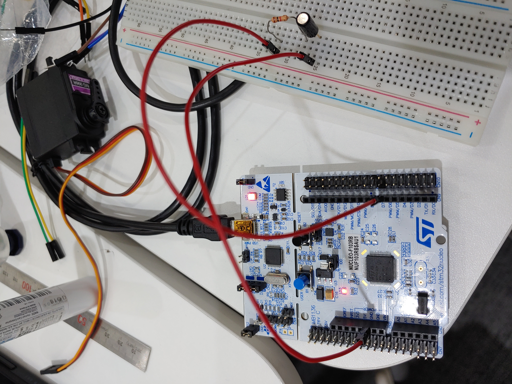

### 틸트

회로도<br>
<br>
PA8번 핀 상태를 읽기만 하므로 내가 구성한 회로도..<br>
*PA8번 핀을 input모드로 했는데 어떻게 제대로 동작할까? (pull-up모드가 아니여도 동작했음)

오리지날 회로도<br>


26번째 줄에 #include <stdio.h> 추가
```c
/* USER CODE BEGIN PFP */
int _write(int fd, char *ptr, int len)
{
	HAL_UART_Transmit(&huart2, (unsigned char*)ptr, len, HAL_MAX_DELAY);
	return len;
}

int _read(int file, char *ptr, int len)
{
	HAL_UART_Receive(&huart2, (unsigned char*)ptr, len, HAL_MAX_DELAY);
	return len;
}

int __io_putchar(int ch)
{
	HAL_UART_Transmit(&huart2, (unsigned char*)&ch, 1, HAL_MAX_DELAY);
	return ch;
}

int __io_getchar(void)
{
	uint8_t ch = 0;
	HAL_UART_Receive(&huart2, (uint8_t *)&ch, 1, HAL_MAX_DELAY);
	return ch;
}
/* USER CODE END PFP */
```
Peripheral Function Prototypes 로 추정되는 영역으로 시스템 콜 함수를 재정의해서 사용.
printf, scanf사용시 호출되는 애들임.
```c
  /* USER CODE BEGIN 1 */
	setvbuf(stdin, NULL, _IONBF, 0);
	setvbuf(stdout, NULL, _IONBF, 0);
  /* USER CODE END 1 */
```
  보통 입출력에 버퍼를 두고 어느정도 쌓이면 출력을 하는데, 위 코드는 버퍼를 사용하지 않고 바로 출력하겠다는 의미
```c
while(1)
{
    /* USER CODE END WHILE */

    /* USER CODE BEGIN 3 */
	printf("is_horizon: %d\r\n", HAL_GPIO_ReadPin(GPIOA, GPIO_PIN_8));
    HAL_Delay(1000);
}
```
  출력하는 부분.
