# ESP01 AT명령어 통신

## 진수 제안
stm32의 시스템과 아두이노 시스템과 ESP01의 시스템이 달라서
보내는거랑 받는데 있어서 같은 "OK"여도 다르게 인식하는거 아닌가?


### 테스트
먼저 ESP01이 망가진건 아닌지 다시 테스트 해보았다.

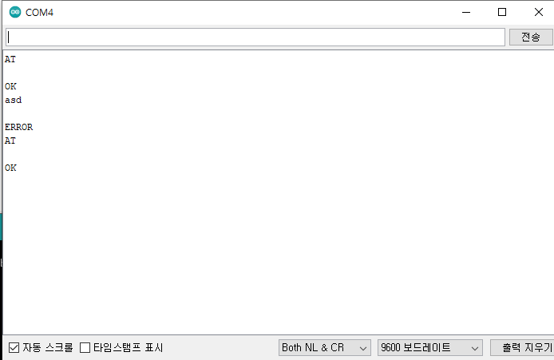

일단 망가진건 없었다.

이번엔 AT을 입력해보면서, 숫자로 바꾸어보자.

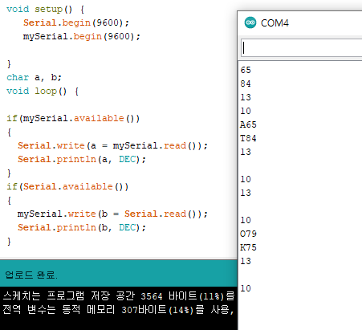

ESP01과 아두이노는 ASCII를 따른다.

AT+RST도 동일함.
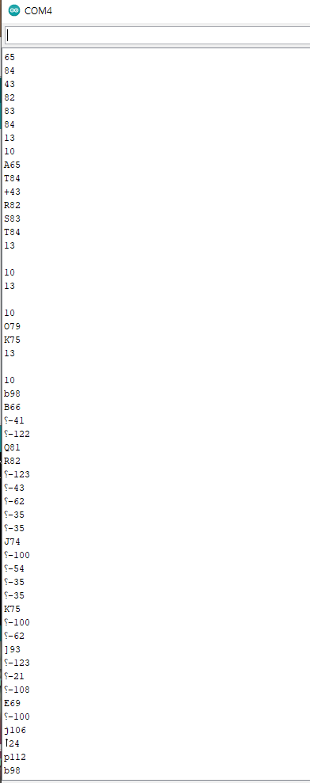

이번엔 stm과 ESP01로 테스트 해보자

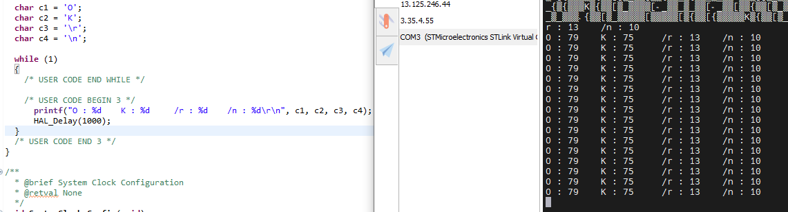

stm도 동일하게 ASCII이다.

혹시나 해서 uint8_t로도 해보았다.

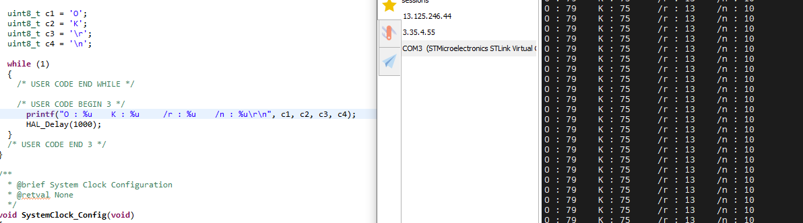

마찬가지로 ASCII이다.

특이사항은 HAL_UART_Transmit()은 아래 사진과 같이 c2에 65를 넣고 출력하면 문자로 나온다.

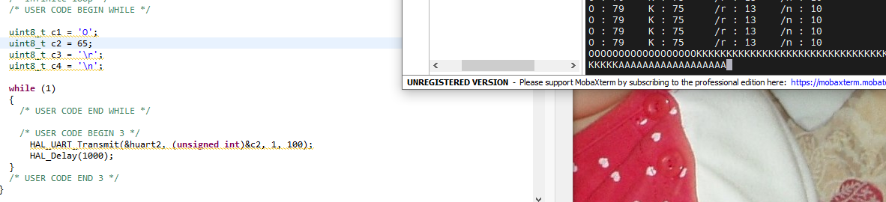

### 결론
셋 모두 ASCII를 따른다. 동일한 환경임

그때 본 숫자들은 쓰레기값이다.


# 계속 인터럽트 방식을 파고 들자.

## 결론 AT를 보내서 OK를 받는건 성공했다. 다만 쓰레기도 같이 출력된다.
따라서 strstr()을 사용해야 할듯하다.

피곤하니 내일하자...


```c

/* USER CODE BEGIN Includes */
#include<stdio.h>
#include<string.h>
/* USER CODE END Includes */

(중략)

/* USER CODE BEGIN 0 */
uint8_t BBOX[50];
uint8_t BBOX_count = 0;

void HAL_UART_RxCpltCallback(UART_HandleTypeDef *huart) {
	if(huart == &huart1) {
		HAL_UART_Receive_IT(&huart1, &BBOX[BBOX_count++], 1);
	}
}

/* USER CODE END 0 */


(중략)


/* USER CODE BEGIN 2 */
  HAL_UART_RxCpltCallback(&huart1);
  HAL_UART_Transmit(&huart2, (uint8_t *)("HI\r\n"), strlen("HI\r\n"), 100);
/* USER CODE END 2 */


(중략)


  /* USER CODE BEGIN WHILE */

  uint8_t send_AT[] = "AT\r\n";

  while (1)
  {
    /* USER CODE END WHILE */

    /* USER CODE BEGIN 3 */
	  for(int i = 0; i < sizeof(send_AT); i++) {
		  HAL_UART_Transmit_IT(&huart1, send_AT, sizeof(send_AT));
		  HAL_Delay(100);
	  }


	  HAL_Delay(100);
	  HAL_UART_Transmit(&huart2, BBOX, strlen(BBOX), 100);

	  HAL_Delay(1000);
  }
  /* USER CODE END 3 */

```

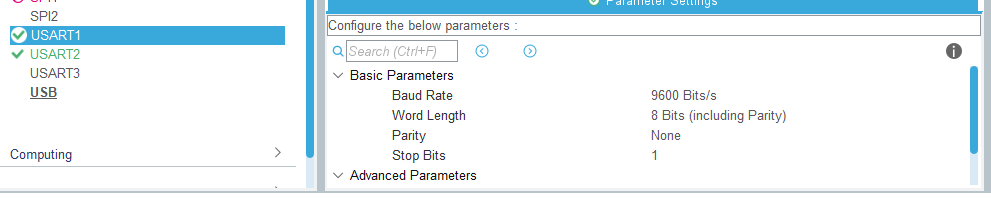
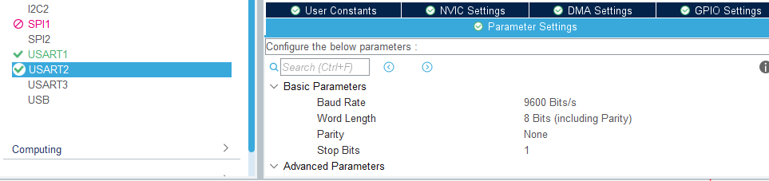

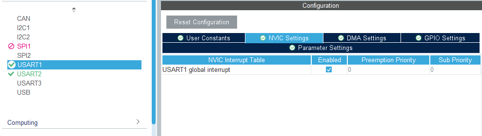


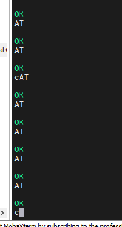

AT를 넣으니 OK가 나왔다.


일단 예상되는 의견은 지금까지 멍청하게 Init()하기 전에 콜백을 선언했었나 보다.

아니면 콜백 함수를 만들고 호출을 안했거나.

사용한 serial tool은 moba X term이다.


근데 AT는 내쪽에서 왜 출력되는걸까??

그리고 c는 어디서 나온거지??


기존 코드의 문제점 부터 파악을 해보았다.

```c
uint8_t BBOX[50];
uint8_t BBOX_count = 0;
uint8_t sendGarbage;

void HAL_UART_RxCpltCallback(UART_HandleTypeDef *huart) {
	if(huart->Instance == USART1) {
		HAL_UART_Receive_IT(huart, &BBOX[BBOX_count++], 1);


	}
}


(중략)


uint16_t len = strlen(BBOX);
	  uint8_t len_str[15] = {0, };
	  sprintf(len_str, "len=%u\r\n", len);
	  HAL_UART_Transmit(&huart2, BBOX, len, 100);
	  HAL_Delay(100);
	  HAL_UART_Transmit(&huart2, len_str, strlength(len_str), 100);
	  HAL_Delay(1000);

```


여기서 문제점은 내가 NULL을 제외하고 배열에 복사앴었다.

또한 BBOX_count를 초기화 하지 않음

다만 AT가 BBOX에 담기는 원인은 아직 파악하지 못함.


사진을 보라. 길이가 10인 경우를 보자. 'A' 'T' '\r' '\n' '\r' '\n' 'O' 'K' 이다.   

다른 특이사항으로는 배열을 넘기면 리시브가 받지 않음 (범위 내의 인데스만 참조할려는듯 함)


또 다른 특이 사항도 있다.

AT\r\n을 한번 보내면 OK가 안 온다. (len=5 무한 반복)

그런데 

```c
// while(1) 밖임
HAL_UART_Transmit(&huart1, send_AT, strlength(send_AT), 100);
HAL_Delay(100);

HAL_UART_Transmit(&huart1, send_AT, strlength(send_AT), 100);
HAL_Delay(100);
```
하면 AT\r\nAT\r\n\r\nOK\r\n이다. 그런데 len=15로 뜬다. (저거 문자열 길이 14여야함)


추가.

동일한 코드로 다시 리셋해서 해봤는데 이번엔 


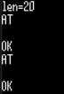

왜 이런걸까??


따라서 나는 다른 해결책을 생각했다.

선형 큐를 받는거다.

front rear 사이를 substr해와서 strstr("OK")를 찾는거다.

시스템 시작


알게된 점 1.
HAL_UART_RxCpltCallback(&huart1); 대신

HAL_UART_Receive_IT(&huart1, &buff, 1);을 하면 상관없다.


의미 -> 콜백을 대기 하겠다!