# STM32 

## 목차

<br><br>

## printf()

디버깅을 위해서 출력은 필수이다.

하지만 기본적으로 ST사에서 제공하는 STM32CubeIDE에선 기능이 없다.

따라서 1학기 처럼 USB uart device를 통해 확인을 하기도 했다.
다만, 현재 USB uart device가 없으므로 다른 방안을 찾아야 했다.

[참고자료] https://forum.digikey.com/t/stm32-printf/31174

[준비물] Tera Term
기본적으로 ST보드의 경우 uart1을 자동 on해놓음

<stdio.h>를 통해 printf()를 하면 주변 기기(uart 또는 usart)로 문자열을 전송함.
현재 ST-link(혹은 USB COM포트의 가상 ST-Link)과 연결된 시리얼을 통해 uart를 생성함
따라서 시리얼 모니터(tera term)로 출력을 확인한다.

[다음과 같은 진행을 한다]
- 프로젝트를 생성한다.

- device configuration tool(MX아이콘)을 누른다.

- 좌측 하단에 USART_TX와 USART_RX가 초록색으로 활성화 된 것이 보인다.

- Connectivity에서 USART2를 선택한다.

- Parameter Settings에서 baud rate와 Paraty, Stop Bits, Word Length를 확인한다.(향후 tera term 설정시 같게 해주어야 함)

- 이제 코드를 generate시킨다.

- main.c에서 
```c
/* USER CODE BEGIN Includes */
#include<stdio.h>
/* USER CODE END Includes */

(중략)


/* USER CODE BEGIN PFP */
#ifdef __GNUC__
#define PUTCHAR_PROTOTYPE int __io_putchar(int ch)
#else
#define PUTCHAR_PROTOTYPE int fputc(int ch, FILE *f)
#endif

PUTCHAR_PROTOTYPE
{
  HAL_UART_Transmit(&huart2, (uint8_t *)&ch, 1, HAL_MAX_DELAY);
  return ch;
}
/* USER CODE END PFP */

(중략)

  /* USER CODE BEGIN WHILE */
  while (1)
  {

    /* USER CODE END WHILE */

    /* USER CODE BEGIN 3 */
	  printf("hello\r\n");
	  HAL_Delay(500);
  }
  /* USER CODE END 3 */


```

아니면 아래처럼 한다.

printf(), scanf() 다른 방법

```c

/* PFP */
int _write(int fd, char *ptr, int len)
{
	HAL_UART_Transmit(&huart2, (unsigned char*)ptr, len, HAL_MAX_DELAY);
	return len;
}

int _read(int file, char *ptr, int len)
{
	HAL_UART_Receive(&huart2, (unsigned char*)ptr, len, HAL_MAX_DELAY);
	return len;
}

int __io_putchar(int ch)
{
	HAL_UART_Transmit(&huart2, (unsigned char*)&ch, 1, HAL_MAX_DELAY);
	return ch;
}

int __io_getchar(void)
{
	uint8_t ch = 0;
	HAL_UART_Receive(&huart2, (uint8_t *)&ch, 1, HAL_MAX_DELAY);
	return ch;
}
/* PFP */


/* main */

setvbuf(stdin, NULL, _IONBF, 0);
setvbuf(stdout, NULL, _IONBF, 0);

/* main */
```


- 이제 tera term에서 사진과 같이 진행한다.

ST보드와 연결된 포트를 선택한다.


Setup > Serial Port

아까 Parameter Settings에서 확인한 세팅으로 바꾼다. 


결과


<br><br><br>

## 펌웨어 단에서 모터 제어하기

<br>


### 구성 환경
- Board  : STM32F103RB
- IDE : STM32CubeIDE
- peripherals : MG996R servo motor

<br>

### 개요
경험의 가치를 포함하며, 단가가 8만원(model-B 4GB기준) 라즈베리파이가 아닌 2만원 stm보드를 사용하기로 정했습니다.

기존의 라즈베리파이를 이용한 servo motor의 제어는 파이썬에서 라이브러리를 통해 원하는 각도를 입력하면 되는 방식이지만, stm보드는 직접 세팅하고 만들어야한다.

<br>

### 과정
servo motor의 제어를 위해선 PWM신호를 입력으로 주어야 한다.

MG996R datasheet를 읽고
이때 신호는 주기 20ms이며, 1~2ms의 duty cycle로 0~180도의 동작한다는 것을 알았다. 

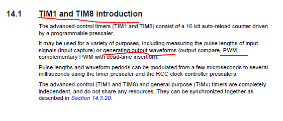

stm32F103RB의 경우, 위 사진처럼 PWM신호는 TIM로 발생시킨다. 신호를 generate를 위한 시스템 클럭과 분주기들의 설정 시킨다.

일단 TIM2를 PWM신호 발생 타이머로 선택했다. 
TIM2는 아래 이미지와 같이 APB1의 클럭을 기준으로 하는걸 알 수 있다.


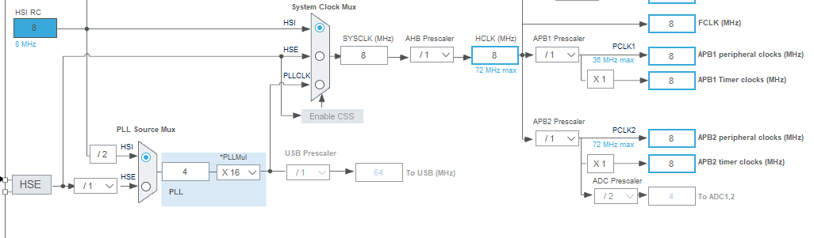

마찬가지로 TIM 레지스터의 config도 GUI를 통해 설정한다


이러면 8Mhz / (16 * 10000) = 50Hz가 된다. 50Hz == 20ms


출처 : rm0008 - stm32F103 reference manual

<br>

### 코드
config를 통해 generate된 주소명과 API를 이용하여 모터를 제어한다.

```c
HAL_TIM_PWM_Start(&htim2,TIM_CHANNEL_1);
```

타이머를 PWM용으로 시작한다.

```c
__HAL_TIM_SET_COMPARE(&htim2, TIM_CHANNEL_1, 500);


HAL_Delay(500);

__HAL_TIM_SET_COMPARE(&htim2, TIM_CHANNEL_1, 750);

HAL_Delay(500);

__HAL_TIM_SET_COMPARE(&htim2, TIM_CHANNEL_1, 1000);

HAL_Delay(500);
```
이떄 500은 10000을 20ms라 할때, 1ms를 의미한다. 마찬가지로 1000은 2ms를 의미한다

<br>

### 결과
예상한 각도는 0도 90도 180도로 움직일거라 생각했지만,
결과는 0도 45도 90도로 나왔다.

어디서 계산이 잘못된건지 더 공부해 봐야할거 같다.

<br><br><br><br>


## 초음파 센서 작동
들어가기 앞서 초음파 센서 작동원리에 대해 의견이 달라서 정리하였다.
- Trigger로 부터 초음파를 발사하는 시점부터 Echo로 초음파가 들어오는 시점의 시간
- Trigger로 부터 초음파를 발사하고, Echo로 초음파가 들어오기 시작하는 시점부터 더 이상 초음파가 들어오지 않는 시점의 시간

본인(김영래)은 첫번째 방식을 생각하고 진행하였다.

기존 코드(printf()까지)에서 이어서 시작한다.

```c

(중략)

/* USER CODE BEGIN 0 */

// Tick을 설정하는 함수 1tick == (1 / 숫자)를 의미한다.
HAL_StatusTypeDef HAL_InitTick(uint32_t TickPriority) {
	  if (HAL_SYSTICK_Config(HAL_RCC_GetHCLKFreq() / 100000) == 0) {
		  printf("HAL_OK\r\n");
	    return HAL_OK;
	  } else {
		  printf("HAL_ERROR\r\n");
	    return HAL_ERROR;
	}
}


/* USER CODE END 0 */


(중략)


/* USER CODE BEGIN 1 */

if (HAL_InitTick(TICK_INT_PRIORITY) != HAL_OK) {
	Error_Handler();
}
/* USER CODE END 1 */


(중략)


/* USER CODE BEGIN WHILE */
  uint32_t st;
  uint32_t ed;
  uint32_t diff;
  uint32_t distance;


  while (1)
  {
    /* USER CODE END WHILE */

    /* USER CODE BEGIN 3 */

    // GPIO를 쓰거나 읽는 방법 예시
	  //HAL_GPIO_WritePin(GPIOA, GPIO_PIN_8, SET);
	  // HAL_GPIO_ReadPin(GPIOA, GPIO_PIN_9)==GPIO_PIN_SET


	  HAL_GPIO_WritePin(GPIOA, GPIO_PIN_8, RESET);
	  HAL_Delay(5);
	  HAL_GPIO_WritePin(GPIOA, GPIO_PIN_8, SET);
	  HAL_Delay(20);
	  HAL_GPIO_WritePin(GPIOA, GPIO_PIN_8, RESET);

	  //printf("right after : %lu\r\n", HAL_GPIO_ReadPin(GPIOA, GPIO_PIN_9));
	  st = HAL_GetTick();
	  while(HAL_GPIO_ReadPin(GPIOA, GPIO_PIN_9)==GPIO_PIN_RESET);
	  while(HAL_GPIO_ReadPin(GPIOA, GPIO_PIN_9)==GPIO_PIN_SET);
	  ed = HAL_GetTick();

	  diff = ed -st;
	  distance = diff * 0.034 / 2;
	  printf("%lu\r\n", diff);

	  //printf("%lu \r\n", micros());
	  HAL_Delay(100000);

  }
  /* USER CODE END 3 */


```

### 새로운 함수
일단 새로운 함수들 부터 설명을 하겠다.
- HAL_GPIO_WritePin(GPIO_PORT, GPIO_PIN_NUMBER, SETTING)
해당하는 GPIO을 다시 설정한다.
GPIO_PORT는 GPIO의 포트를 의미하며 해당 보드(STM32F103RB)에선 A부터 C까지 있는것으로 핀맵에 나타난다.
다음과 같이 넣는다. GPIOA 또는 GPIOB ... GPIOx로 부터 shift한 주소를 가진다.
GPIO_PIN_NUMBER는 각 포트마다 PIN이 1-10이 있다.
Setting은 GPIO를 어떻게 설정할지를 결정한다. SET은 ON 또는 HIGH또는 1로 // RESET은 OFF 또는 LOW 또는 0으로 설정한다.

- HAL_GPIO_ReadPin(GPIO_PORT, GPIO_PIN_NUMBER)
해당하는 GPIO의 값을 읽는다.
return값으로 GPIO_PIN_RESET(0)과 GPIO_PIN_SET(1)이 있다.

- HAL_GetTick()
현재 Tick값을 가져온다. 
Tick이란 시스템에 있어서 시간 단위이며, 아래 함수로 부터 설정된 시간(오실레이터의 진동)마다 Tick Interrupt가 발생된다.
이때, Tick++ 한다. 

- HAL_InitTick(TICK_INT_PRIORITY)
Tick Interrupt의 주기를 설정한다. 

```c

HAL_StatusTypeDef HAL_InitTick(uint32_t TickPriority) {
	  if (HAL_SYSTICK_Config(HAL_RCC_GetHCLKFreq() / 100000) == 0) {
		  printf("HAL_OK\r\n");
	    return HAL_OK;
	  } else {
		  printf("HAL_ERROR\r\n");
	    return HAL_ERROR;
	}
}

```

위 코드는 함수를 재 정의한 것이다.
저기서 숫자(100000)의 값을 바꾸면 Tick Interrupt의 주기가 바뀐다.
1000이 기본값이며, 1/1000초 마다 TIck Interrupt가 발생한다.
10000이면 1/10000초 마다 TIck Interrupt가 발생한다.

즉, 값이 클수록 1초동안 TIck의 값이 더 크게 증가한다.

[중요한 점]
또한 Tick을 기준으로 delay하는 HAL_Delay()도 Tick Interrupt주기에 따라 값을 다르게 넣어줘야한다.

### 함수를 통한 코드
/* USER CODE BEGIN WHILE */ 부터  /* USER CODE END 3 */ 까지

```c

HAL_GPIO_WritePin(GPIOA, GPIO_PIN_8, RESET);
HAL_Delay(5);
HAL_GPIO_WritePin(GPIOA, GPIO_PIN_8, SET);
HAL_Delay(20);
HAL_GPIO_WritePin(GPIOA, GPIO_PIN_8, RESET);

```

Trigger로 부터 초음파를 20 Tick동안 쏜다.


```c

st = HAL_GetTick();
while(HAL_GPIO_ReadPin(GPIOA, GPIO_PIN_9)==GPIO_PIN_RESET);
while(HAL_GPIO_ReadPin(GPIOA, GPIO_PIN_9)==GPIO_PIN_SET);
ed = HAL_GetTick();

```

받고 끝날때 까지의 시간을 기록한다.

```c

diff = ed -st;
distance = diff * 0.034 / 2;
printf("%lu\r\n", diff);


```

차이를 출력한다.
여기서 diff는 음파가 340/ms이고 왔다가 다시 돌아오기에 /2다.


### 초음파 결론

```c
HAL_StatusTypeDef HAL_InitTick(uint32_t TickPriority) {
	  if (HAL_SYSTICK_Config(HAL_RCC_GetHCLKFreq() / 1000) == 0) {
	    return HAL_OK;
	  } else {
	    return HAL_ERROR;
	}
}
```

로 세팅하면 diff가 2 3 4 5로 나타난다.


```c
HAL_StatusTypeDef HAL_InitTick(uint32_t TickPriority) {
	  if (HAL_SYSTICK_Config(HAL_RCC_GetHCLKFreq() / 10000) == 0) {
	    return HAL_OK;
	  } else {
	    return HAL_ERROR;
	}
}
```

로 세팅하면 diff가 20 21 22 ~ 48 49 50 ...
로 10배 더 세분화된다.

1000000부터는 불가능(1us) -> 1MHz
72 MHz maximum frequency이며, 현재 내부 클럭을 HSI로 하여 8MHz임
즉 8클럭 안에 SysTick Handler를 수행해야함 <- 불가능
10us(100000)도 위험할지도 모름, 80클럭 안에 SysTick Handler는 수행이 가능하겠지만,
점점 더 늘어날 코드를 고려한다면, 함수화 시켜서 가능할지도 모름.


<br>
100us
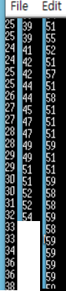

<br>
10us


 


<br>


## 타이머

TIM1을 기준으로 작성함. (8MHz)

 TIM1을 선택함.

 Clock Source를 Internal Clock으로 선택함

 NVIC에서 TIM1 upgrade interrupt와 TIM1 capture compare interrupt를 체크한다.

 코드 제네레이트하자


```c
/* USER CODE END PM */

/* Private variables ---------------------------------------------------------*/
TIM_HandleTypeDef htim1; // tim.h에 있을 수 도 있음

UART_HandleTypeDef huart2; // uart.h에 있을 수 도 있음

/* USER CODE BEGIN PV */
/* USER CODE END PV */

/* Private function prototypes -----------------------------------------------*/
void SystemClock_Config(void);
static void MX_GPIO_Init(void);
static void MX_USART2_UART_Init(void);
static void MX_TIM1_Init(void);

(중략)

/* Private user code ---------------------------------------------------------*/


 /* USER CODE BEGIN 0 */

uint32_t overflows = 0U;

void HAL_TIM_PeriodElapsedCallback(TIM_HandleTypeDef *htim) { // 제네레이트 없음
	if(htim->Instance == TIM1) {
		overflows++;
	}
}


uint32_t GetMicroSec(void){ // 제네레이트 없음
	uint32_t count = __HAL_TIM_GET_COUNTER(&htim1);
	uint32_t overflow = overflows;
	if (__HAL_TIM_GET_FLAG(&htim1, TIM_FLAG_UPDATE) && (count < 0x8000)) {
	        overflow++;
	}

	return(overflow << 16) + count;
}

/* USER CODE END 0 */


(중략)

/* USER CODE BEGIN WHILE */
  HAL_TIM_Base_Init(&htim1);         // 제네레이트 없음
  __HAL_TIM_SET_COUNTER(&htim1, 0);  // 제네레이트 없음
  HAL_TIM_Base_Start_IT(&htim1);     // 제네레이트 없음
  while (1)
  {
    /* USER CODE END WHILE */

    /* USER CODE BEGIN 3 */
	  uint32_t start = GetMicroSec();
	  HAL_Delay(100);
	  uint32_t end = GetMicroSec();
	  printf("\r\n aaa : %lu \r\n", end - start);
  }
  /* USER CODE END 3 */


(중략)

static void MX_TIM1_Init(void) // tim.c에 있을 수도 있음
{

  /* USER CODE BEGIN TIM1_Init 0 */

  /* USER CODE END TIM1_Init 0 */

  TIM_ClockConfigTypeDef sClockSourceConfig = {0};
  TIM_MasterConfigTypeDef sMasterConfig = {0};

  /* USER CODE BEGIN TIM1_Init 1 */

  /* USER CODE END TIM1_Init 1 */
  htim1.Instance = TIM1;
  htim1.Init.Prescaler = 7;						// 여기를 0->7(== 8-1) 이러면 8Mhz / 8 ==> 1Mhz가 된다. 왜 해야하나면 8
  htim1.Init.CounterMode = TIM_COUNTERMODE_UP;
  htim1.Init.Period = 65535;
  htim1.Init.ClockDivision = TIM_CLOCKDIVISION_DIV1;
  htim1.Init.RepetitionCounter = 0;
  htim1.Init.AutoReloadPreload = TIM_AUTORELOAD_PRELOAD_DISABLE;
  if (HAL_TIM_Base_Init(&htim1) != HAL_OK)
  {
    Error_Handler();
  }
  sClockSourceConfig.ClockSource = TIM_CLOCKSOURCE_INTERNAL;
  if (HAL_TIM_ConfigClockSource(&htim1, &sClockSourceConfig) != HAL_OK)
  {
    Error_Handler();
  }
  sMasterConfig.MasterOutputTrigger = TIM_TRGO_RESET;
  sMasterConfig.MasterSlaveMode = TIM_MASTERSLAVEMODE_DISABLE;
  if (HAL_TIMEx_MasterConfigSynchronization(&htim1, &sMasterConfig) != HAL_OK)
  {
    Error_Handler();
  }
  /* USER CODE BEGIN TIM1_Init 2 */

  /* USER CODE END TIM1_Init 2 */

}


(중략)

static void MX_USART2_UART_Init(void) // usart.c 에 있을 수도 있음
{

  /* USER CODE BEGIN USART2_Init 0 */

  /* USER CODE END USART2_Init 0 */

  /* USER CODE BEGIN USART2_Init 1 */

  /* USER CODE END USART2_Init 1 */
  huart2.Instance = USART2;
  huart2.Init.BaudRate = 115200;
  huart2.Init.WordLength = UART_WORDLENGTH_8B;
  huart2.Init.StopBits = UART_STOPBITS_1;
  huart2.Init.Parity = UART_PARITY_NONE;
  huart2.Init.Mode = UART_MODE_TX_RX;
  huart2.Init.HwFlowCtl = UART_HWCONTROL_NONE;
  huart2.Init.OverSampling = UART_OVERSAMPLING_16;
  if (HAL_UART_Init(&huart2) != HAL_OK)
  {
    Error_Handler();
  }
  /* USER CODE BEGIN USART2_Init 2 */

  /* USER CODE END USART2_Init 2 */

}


(중략)


static void MX_GPIO_Init(void) // gpio.c에 있을 수도 있음
{
  GPIO_InitTypeDef GPIO_InitStruct = {0};
/* USER CODE BEGIN MX_GPIO_Init_1 */
/* USER CODE END MX_GPIO_Init_1 */

  /* GPIO Ports Clock Enable */
  __HAL_RCC_GPIOC_CLK_ENABLE();
  __HAL_RCC_GPIOD_CLK_ENABLE();
  __HAL_RCC_GPIOA_CLK_ENABLE();
  __HAL_RCC_GPIOB_CLK_ENABLE();

  /*Configure GPIO pin Output Level */
  HAL_GPIO_WritePin(LD2_GPIO_Port, LD2_Pin, GPIO_PIN_RESET);

  /*Configure GPIO pin : B1_Pin */
  GPIO_InitStruct.Pin = B1_Pin;
  GPIO_InitStruct.Mode = GPIO_MODE_IT_RISING;
  GPIO_InitStruct.Pull = GPIO_NOPULL;
  HAL_GPIO_Init(B1_GPIO_Port, &GPIO_InitStruct);

  /*Configure GPIO pin : LD2_Pin */
  GPIO_InitStruct.Pin = LD2_Pin;
  GPIO_InitStruct.Mode = GPIO_MODE_OUTPUT_PP;
  GPIO_InitStruct.Pull = GPIO_NOPULL;
  GPIO_InitStruct.Speed = GPIO_SPEED_FREQ_LOW;
  HAL_GPIO_Init(LD2_GPIO_Port, &GPIO_InitStruct);

  /* EXTI interrupt init*/
  HAL_NVIC_SetPriority(EXTI15_10_IRQn, 0, 0);
  HAL_NVIC_EnableIRQ(EXTI15_10_IRQn);

/* USER CODE BEGIN MX_GPIO_Init_2 */
/* USER CODE END MX_GPIO_Init_2 */
}

```

<br><br>

## 초음파 advanced (아직 해보진 않음)

### 개요
기존의 초음파 코드는 Tick interrupt의 Period를 조작하는 방식(아래 코드 참조)으로 진행함(위에(챕터 초음파) 자세한 코드가 있음)

```c
HAL_StatusTypeDef HAL_InitTick(uint32_t TickPriority) {
	  if (HAL_SYSTICK_Config(HAL_RCC_GetHCLKFreq() / 100000) == 0) {
		  printf("HAL_OK\r\n");
	    return HAL_OK;
	  } else {
		  printf("HAL_ERROR\r\n");
	    return HAL_ERROR;
	}
}

(중략)

if (HAL_InitTick(TICK_INT_PRIORITY) != HAL_OK) {
	Error_Handler();
}

```

하지만 이번엔 위 챕터 TIM를 통해서 defualt Tick Interrupt의 Period (1000Hz)를 기준으로 한다.

TIM 챕터에서 주기가 1KHz임에도 Tick을 1증가 시키는 척도인 클럭의 몇번 움직였는가?를 확인할

```c
__HAL_TIM_GET_COUNTER(&htim1);
```
를 사용했었다.


### 진행 과정 (사진 28장)
<br>
사진 1

Clock config하는 사진입니다. HSI(고속 내부 클럭)으로 바꿔 주시고 8Mhz인걸 확인해주세요. APB1 Prescalar를 /1로 하고, 오른쪽에 있는게 마지막을 제외하고 전부 8로 나와야 합니다.

<br>

사진 2
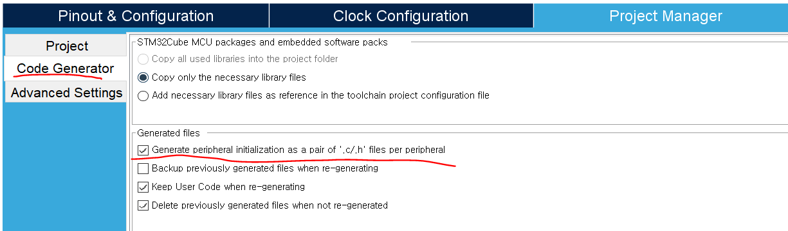
코드를 생성하는 설정을 진행하겠습니다.
위 처럼 진행하고 Generate Pheriparal ~를 체크해 주세요.

이거 까먹으면 코드 위치가 이상해지고, 생성이 안되는 불상사가 발생합니다.

만약, 까먹은 상태로 아래것들을 진행하셨다면 프로젝트부터 다시 생성해서 [사진1]부터 다시 진행하세요.

<br>

사진 3
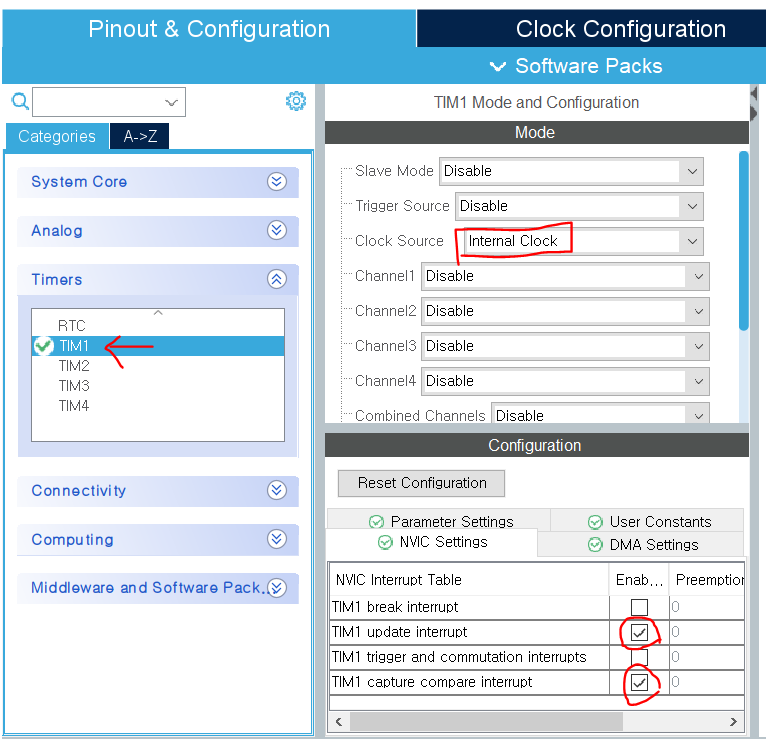

타이머 세팅입니다. 따로 핀 설정은 없으며, Timers를 선택하시고 TIM1을 눌러주새요.

그러면 사진 우측과 같이 TIM1 Mode andConfiguration이 뜰겁니다.

여기서 Clock source를 Internal clock(== HSI, 보드에 내장된 고속 클럭)를 선택해 주시고

NVIC Setting(인터럽트 세팅)은 

TIM1 update Interrupt와 TIM1 capture compare Interrupt를 체크해 주세요.

안 그러면 Timer에서 Tick이 증가하는 인터럽트 코드를 수정하지 못해요.

<br>

사진 4
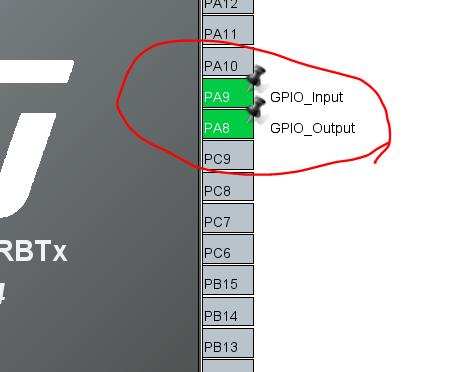

이번엔 초음파의 PIN설정을 해주겠습니다.

PA_8과 PA_9를 GPIO PIN으로 만들겠습니다.

PA_9는 INPUT으로 Echo와 연결합니다.

PA_8은 OUTPUT으로 TRIG와 연결합니다. 

초음파는 TRIG에서 쏴서 Echo로 들어갑니다.

<br>

사진 5
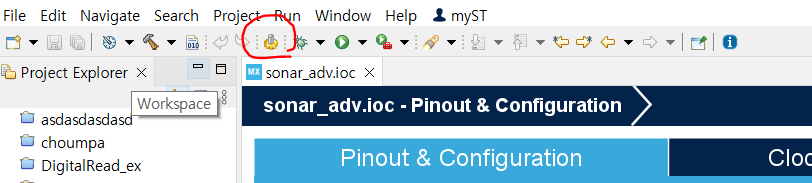
이제 pheriparal에 해당하는 코드들을 Generate하겠습니다.

<br>

사진 6

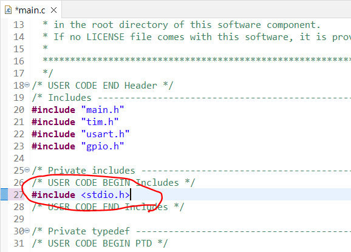

이제 printf()를 뚫어 주겠습니다.

사진과 같은 위치에다가 

```c
/* USER CODE BEGIN Includes */
#include <stdio.h>
/* USER CODE END Includes */
```
를 해주세요.

다른 주석 위치에 작성하시면 안됩니다.

<br>

사진 7

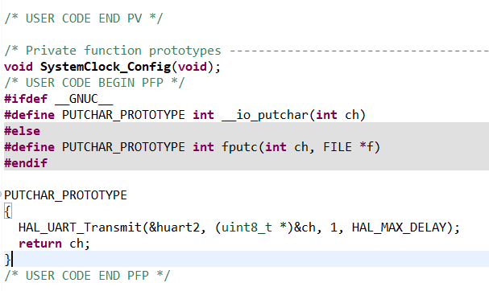

printf()를 override해야하는데 printf()의 기본인 putchar를 override를 해서, 결과적으로 printf()를 override하는 방향으로 가겠습니다.

사진과 같은 코드를 작성해 주세요.

```c
/* USER CODE BEGIN PFP */
#ifdef __GNUC__
#define PUTCHAR_PROTOTYPE int __io_putchar(int ch)
#else
#define PUTCHAR_PROTOTYPE int fputc(int ch, FILE *f)
#endif

PUTCHAR_PROTOTYPE
{
  HAL_UART_Transmit(&huart2, (uint8_t *)&ch, 1, HAL_MAX_DELAY);
  return ch;
}
/* USER CODE END PFP */
```

<br>

사진 8

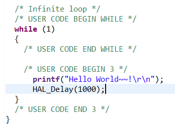

이제 printf()가 정상 작동하는지 확인하겠습니다.

```c
while (1)
  {
    /* USER CODE END WHILE */

    /* USER CODE BEGIN 3 */
	  printf("Hello World~~!\r\n");
    HAL_Delay(1000);
  }
  /* USER CODE END 3 */
```

<br>

사진 9


이제 코드를 실행 해봅시다.

<br>


사진 10

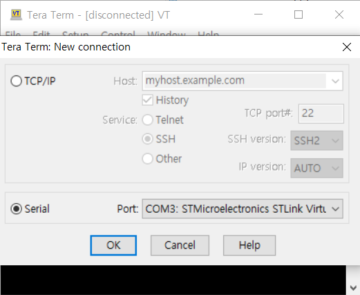

출력을 보기 위해 Tera Term에서 사진과 같이 선택합니다.

<br>

사진 11

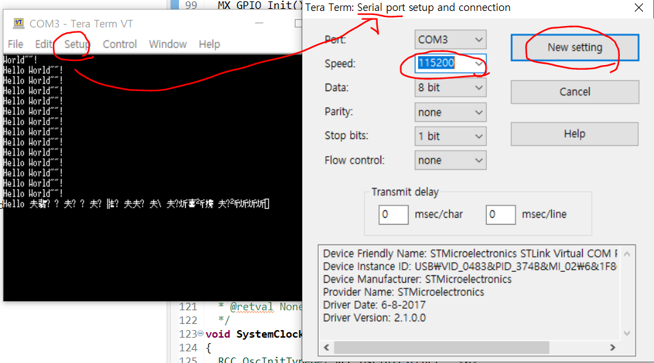

마찬가지로 baud rate도 같게 설정합니다.(UART2의 기본 baud rate는 115200입니다.)

<br>

사진 12


출력이 잘 되는걸 확인합니다.

<br>


사진 13

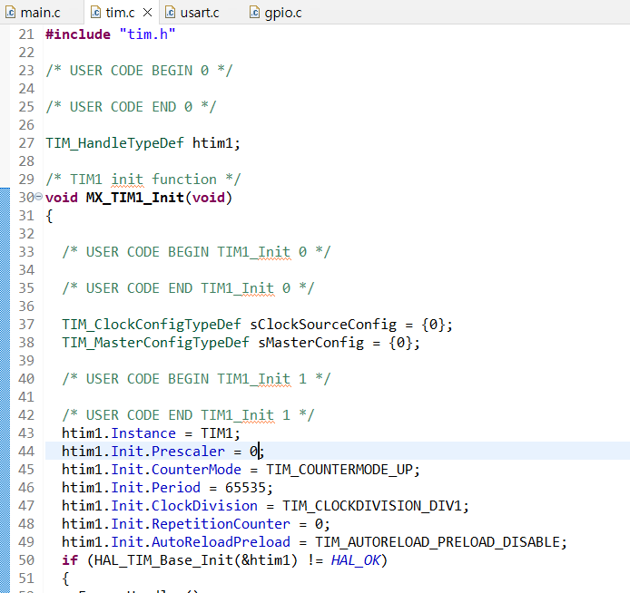

tim.c에 MX_TIM1_Init()이 Genetate 된걸 확인해 주세요.

나중에 tim.c를 수정할거니 잘 기억해 주세요.

해당 코드 또는 tim.c가 없다면 사진2를 다시 확인하세요.

<br>

사진 14

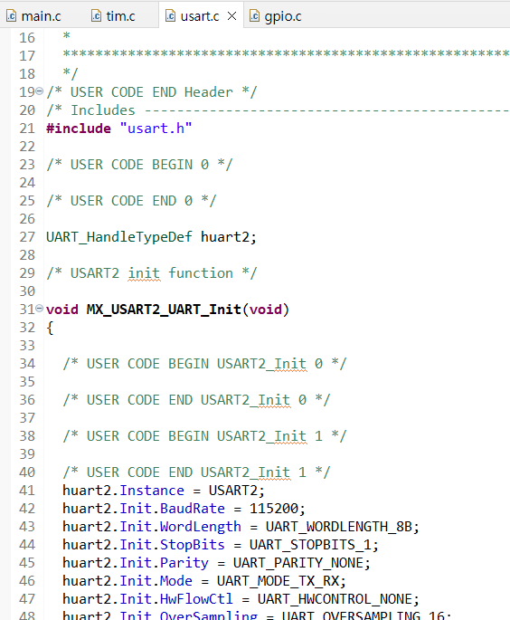

uart.c에 MX_USART2_UART_Init()이 Generate된걸 확인 해 주세요.

해당 코드 또는 uart.c가 없다면 사진2를 다시 확인하세요.

<br>

사진 15

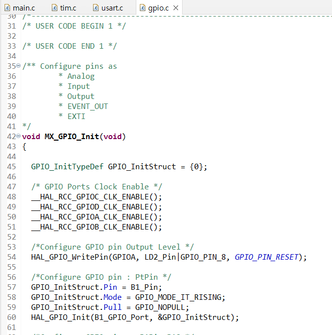

gpio.c에서 MX_GPIO_Init()가 Generate된걸 확인해 주세요.

해당 코드 또는 gpio.c가 없다면 사진2를 다시 확인하세요.

<br>

사진 16

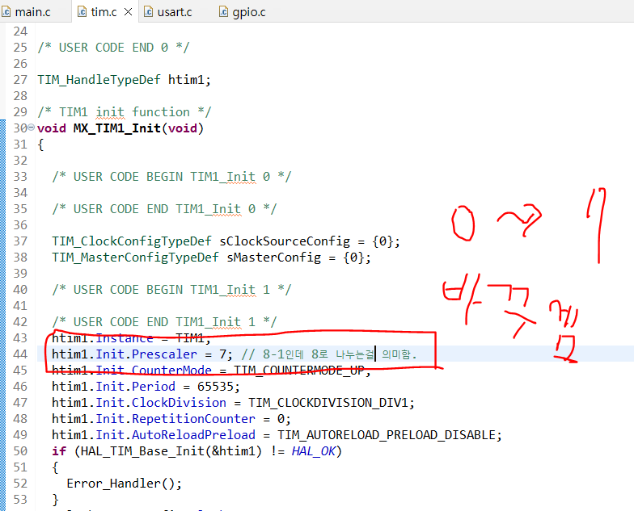

이제 사진 14에서 tim.c를 수정한다고 했는데

사진처럼 

```c
htim1.Init.Prescalar = 0;
```
을
```c
htim1.Init.Prescalar = 7;
```
로 바꿔주세요.

이 코드의 의미는 8-1 = 7인데 8Mhz의 클럭을 /8하여 1Mhz로 하겠다는 것 입니다.(앞자리가 8이면 계산하기 힘들잖아요)

<br>

사진 17

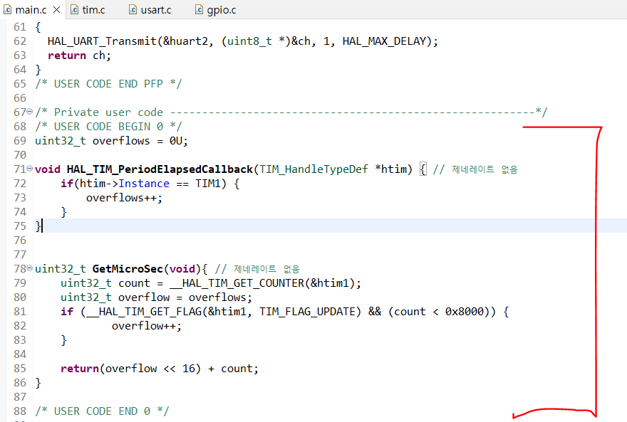

이번엔 TIM를 테스트 해보겠습니다.

다음과 같이 코드를 작성하세요.

```c
/* USER CODE BEGIN 0 */
uint32_t overflows = 0U;

void HAL_TIM_PeriodElapsedCallback(TIM_HandleTypeDef *htim) { // 제네레이트 없음
	if(htim->Instance == TIM1) {
		overflows++;
	}
}


uint32_t GetMicroSec(void){ // 제네레이트 없음
	uint32_t count = __HAL_TIM_GET_COUNTER(&htim1);
	uint32_t overflow = overflows;
	if (__HAL_TIM_GET_FLAG(&htim1, TIM_FLAG_UPDATE) && (count < 0x8000)) {
	        overflow++;
	}

	return(overflow << 16) + count;
}

/* USER CODE END 0 */
```

<br>

사진 18

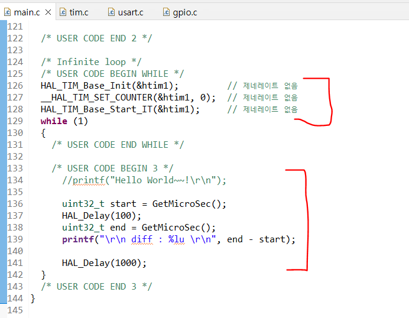

```c
/* USER CODE BEGIN WHILE */
  HAL_TIM_Base_Init(&htim1);         // 제네레이트 없음
  __HAL_TIM_SET_COUNTER(&htim1, 0);  // 제네레이트 없음
  HAL_TIM_Base_Start_IT(&htim1);     // 제네레이트 없음
 while (1)
  {
    /* USER CODE END WHILE */

    /* USER CODE BEGIN 3 */
	  //printf("Hello World~~!\r\n");

	  uint32_t start = GetMicroSec();
	  HAL_Delay(100);
	  uint32_t end = GetMicroSec();
	  printf("\r\n diff : %lu \r\n", end - start);

    HAL_Delay(1000);
  }
```

<br>

사진 19

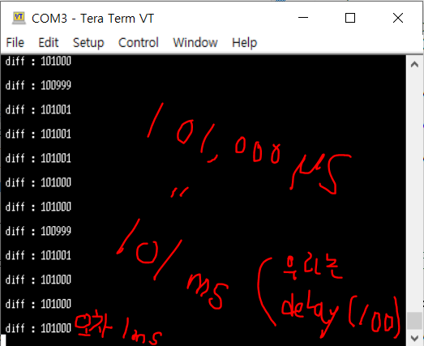

사진과 같이 출력되면 성공입니다.

출력의 숫자값은 us(마이크로 초)를 의미합니다.

저희 코드에서는 start와 end사이에 HAL_Delay(100)을 주었습니다.(0.1초를 의미함. why? -> 1Tick은 1ms이므로)

출력이 101,000us이므로 101ms와 같습니다. 오차가 1ms가 있습니다.

<br>


사진 20

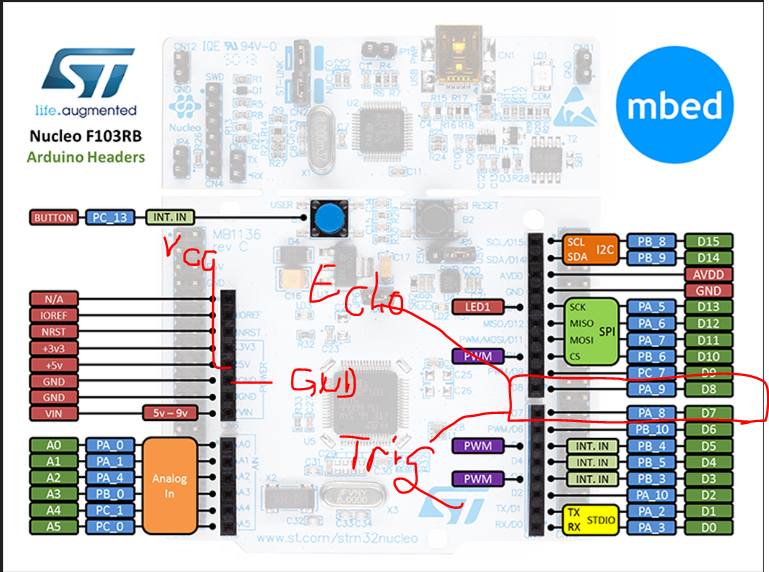

이제 이번 챕터의 목표인 TIM을 이용한 초음파 센서를 해야합니다.

사진은 stm32F103RB의 핀맵입니다.

여기서 VCC로 5V를, GND로 GND를, PA_9로 Echo를, PA_8로  Trig를 각각 연결해주세요.

별도의 저항은 필요 없습니다. 점퍼선은 F-M이 필요합니다.

<br>

사진 21

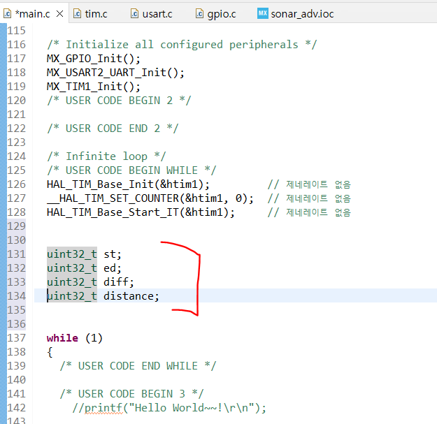

사진과 같이 코드를 추가하세요 (사진에서 distance의 타입을 float로 변경해주세요 ㅠㅜ)

```c
uint32_t st;
uint32_t ed;
uint32_t diff;
float distance;
```

<br>

사진 22

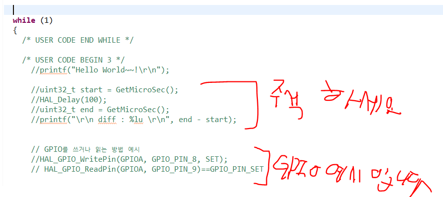

사진과 같이 해주세요 (기존 확인용 코드 주석 꼭 해야합니다.)


<br>

사진 23

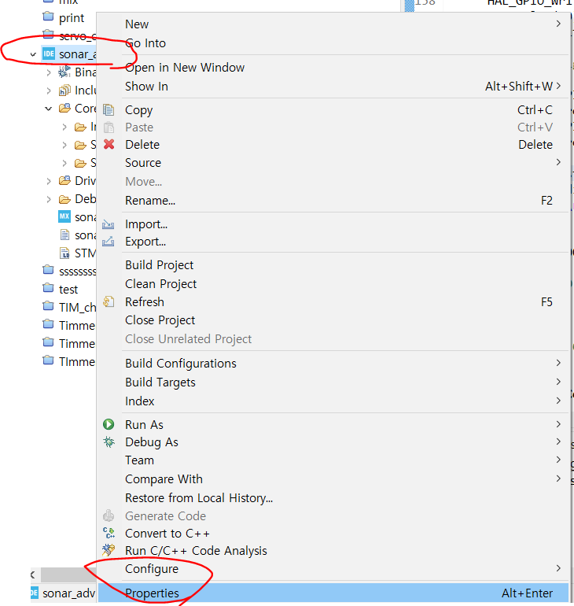

stm32F103RB에는 FPU가 없습니다.  따라서 별도의 설정이 필요합니다.

사진과 같이 해당하는 프로젝트를 우클릭하시고 Properties를 눌러주세요.


<br>


사진 24

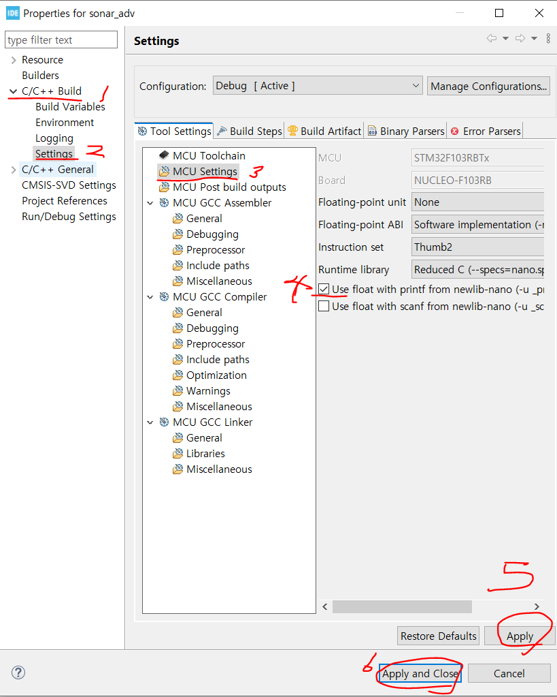

다음과 같은 순서로 체크하세요.

중간에 사진25와 같이 뜰텐데 Rebuid Index 해주셔야 헙니다.

<br>

사진 25

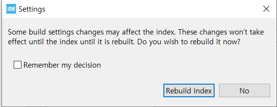

(설명 없음)

<br>

사진 26

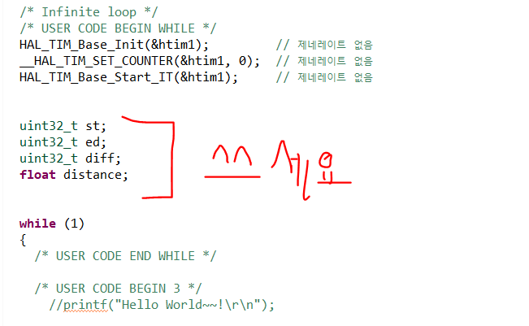

이미 바꾸셨겠지만, distance의 type을 float로 바꿔 주세요.

<br>


사진 27

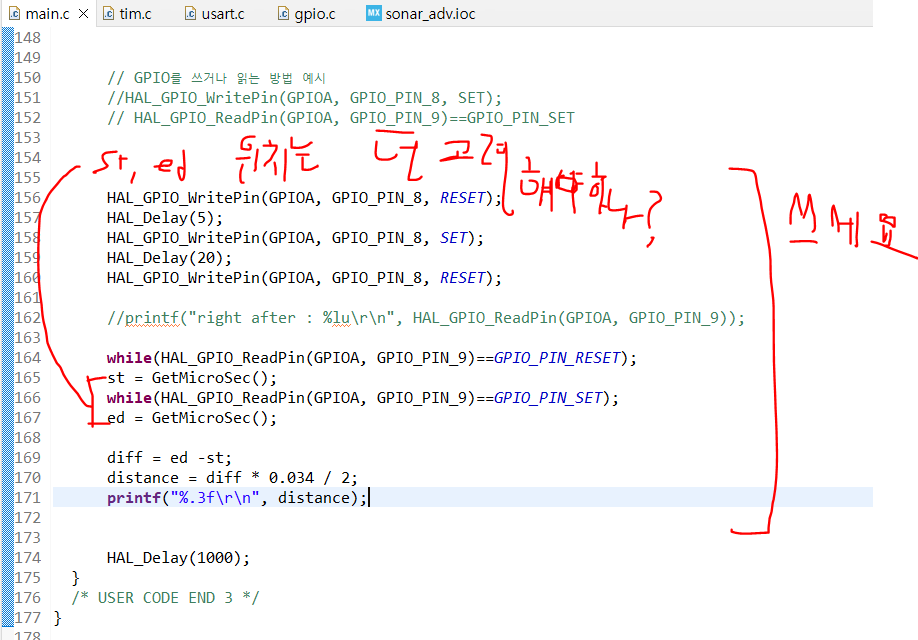

```c
while (1)
  {
    /* USER CODE END WHILE */

    /* USER CODE BEGIN 3 */
	  //printf("Hello World~~!\r\n");

	  //uint32_t start = GetMicroSec();
	  //HAL_Delay(100);
	  //uint32_t end = GetMicroSec();
	  //printf("\r\n diff : %lu \r\n", end - start);


	  // GPIO를 쓰거나 읽는 방법 예시
	  //HAL_GPIO_WritePin(GPIOA, GPIO_PIN_8, SET);
	  // HAL_GPIO_ReadPin(GPIOA, GPIO_PIN_9)==GPIO_PIN_SET


	  HAL_GPIO_WritePin(GPIOA, GPIO_PIN_8, RESET);
	  HAL_Delay(5);
	  HAL_GPIO_WritePin(GPIOA, GPIO_PIN_8, SET);
	  HAL_Delay(20);
	  HAL_GPIO_WritePin(GPIOA, GPIO_PIN_8, RESET);

	  //printf("right after : %lu\r\n", HAL_GPIO_ReadPin(GPIOA, GPIO_PIN_9));

	  while(HAL_GPIO_ReadPin(GPIOA, GPIO_PIN_9)==GPIO_PIN_RESET);
	  st = GetMicroSec();
	  while(HAL_GPIO_ReadPin(GPIOA, GPIO_PIN_9)==GPIO_PIN_SET);
	  ed = GetMicroSec();

	  diff = ed -st;
	  distance = diff * 0.034 / 2;
	  printf("%.3f\r\n", distance);


	  HAL_Delay(1000);
  }
  /* USER CODE END 3 */
```

HAL_GPIO_WritePin(GPIOA, GPIO_PIN_8, RESET)같은 함수들은 기존의 초음파 챕터에 설명이 되어 있습니다.

<br>

사진 28

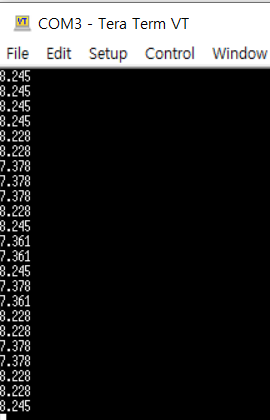

다음과 같이 출력이 나오면 됩니다.

아직 거리에 대한 오차가 있으니, 아이디어가 있으면 알려주세요


<br><br>


## Tilt 센서(기울기 센서)

### 개요
해당 tilt 센서(SW-520D)는 LOW/HIGH만 있다.
왜냐하면, 해당 센서의 내부는 떨어진 선 두 개와 움직이는 금속 구슬 하나가 안에 있다.
이 움직으는 금속 구슬이 두 선을 쇼트 시키면 전기가 통하는 방식이다.

### 핀 셋팅

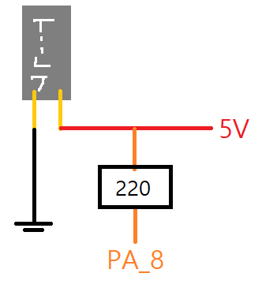

회로는 아래 사진으로 대체한다. PA_8 핀을 입력 모드로 받는다.

해당 회로는 구슬이 선들을 쇼트 시키면 GND로 신호가 빠져나간다. 
샌서를 세우면 두 선이 쇼트 되므로 PA_8에 신호가 가지 않아 LOW가 출력된다.

반대로 기울이면 두 선이 오픈이므로 GND로 신호가 빠져나가지 못하여 PA_8로 HIGH신호가 들어간다.


### config

사진으로 대체한다.
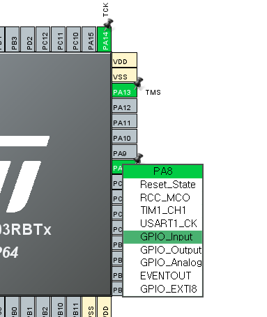
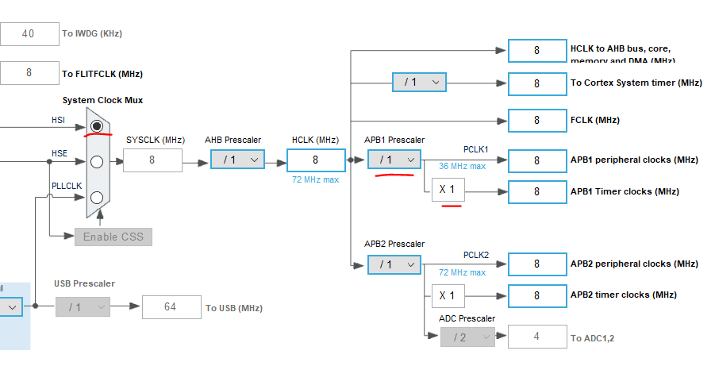
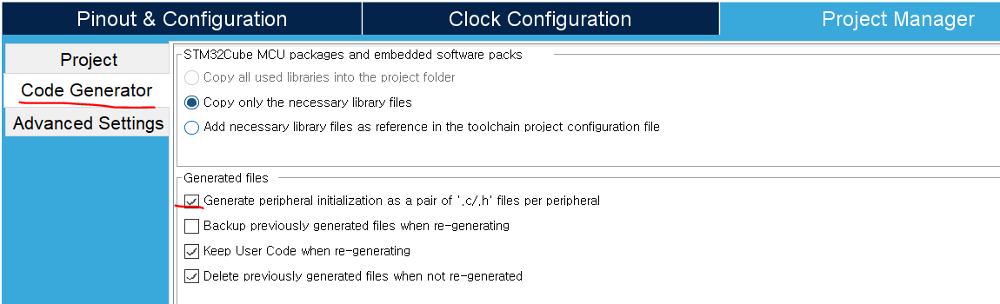


### 코드
```c
/* USER CODE BEGIN WHILE */
  while (1)
  {
    /* USER CODE END WHILE */

    /* USER CODE BEGIN 3 */
	  is_horizon = HAL_GPIO_ReadPin(GPIOA, GPIO_PIN_8);
	  printf("Digital Read test\r\n");
	  printf("is_horizon : %lu\r\n", is_horizon);

	  HAL_Delay(1000);
  }
/* USER CODE END 3 */
```
해당 코드의 printf()를 뚫는건 생략하겠음 (모르면 첫 챕터 printf() 뚫기를 참조하시오.)


### 결과
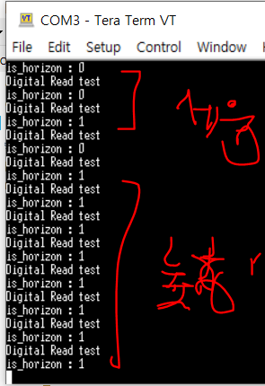


<br><br>


## 비접촉 온도센서(IR방식) - gy-906(비주류 이름) // MLX90614(주류 이름)

이번 프로젝트에서는 사용자 정의 라이브러리를 사용하는 방법을 포함하고 있습니다.

이를 통해 본인이 ESP제외하고 지금까지 만든 디바이스들을 함수화 및 라이브러리화를 할 수 있게 해야한다.

사진 1 

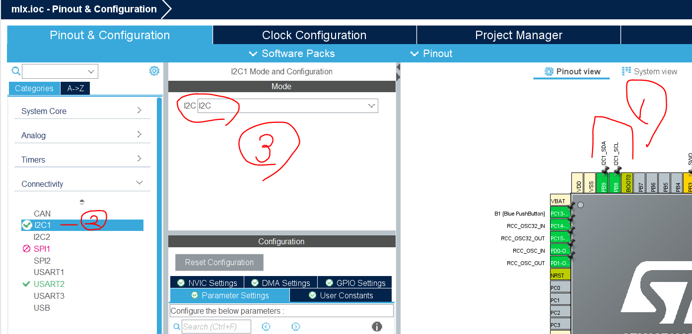

MLX90614는 I2C (SDA, SCL)을 사용합니다.

따라서 해당하는 핀을 보드에서 설정해주어야 합니다.

사진과 같이 

PB_8과 PB_9를 설정해주세요.

그리고 Connectivity에서 I2C1의 설정을 진행해 주세요.

<br>

사진 2

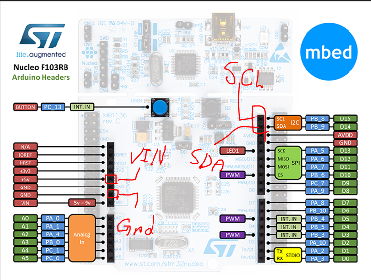

MLX90614와 보드를 직접 연결하여도 상관이 없습니다.

이떄 SCL은 SCL에 SDA는 SDA에 연결합니다. ( UART처럼 꼬아서 하시면 안됩니다! )

<br>

사진 3

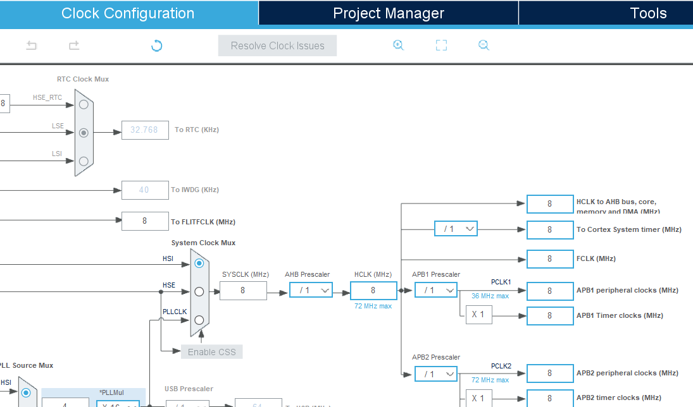

저희의 Clock 설정은 이렇게 계속 진행합니다.

코드 제네레이트는 생략하겠습니다. (모르시면 초음파 adv를 참고해 주세요)

<br>

사진 4

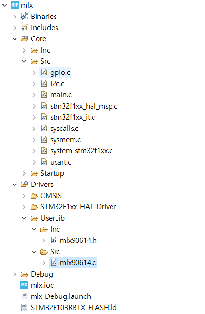

사용자 정의 라이브러리를 위한 폴더 UserLib를 Drivers폴더 아래에 생성합니다.

만든 UserLib아래에 폴더 Inc 와 폴더 Src를 만듭니다.

폴더 Inc에 mlx90614.h를 생성합니다.

폴더 Src에 mlx90614.c를 생성합니다. (확장자를 제외하고, 헤더 파일과 이름이 같아야 합니다.)

각 파일에 아래의 코드를 넣어주세요.

header
```c
/*
 * mlx90614.h
 *
 *  Created on: Jan 23, 2024
 *      Author: SSAFY
 */

#ifndef USERLIB_INC_MLX90614_H_
#define USERLIB_INC_MLX90614_H_


#endif /* USERLIB_INC_MLX90614_H_ */

#ifndef MLX90614_H_
#define MLX90614_H_

#include "stm32f1xx_hal.h"

#define MLX90614_I2C_ADDR 0x5A << 1  // mlx90614 I2C 주소

float MLX90614_ReadTemperature(void);

#endif /* MLX90614_H_ */

```

source
```c
#include "mlx90614.h"

extern I2C_HandleTypeDef hi2c1; // I2C 핸들러

float MLX90614_ReadTemperature(void) {
  uint8_t data[3];
  HAL_I2C_Mem_Read(&hi2c1, MLX90614_I2C_ADDR, 0x07, I2C_MEMADD_SIZE_8BIT, data, 3, HAL_MAX_DELAY);

  int16_t rawTemperature = (data[1] << 8) | data[0];
  float temperature = rawTemperature * 0.02 - 273.15;

  return temperature;
}
```

MLX90614_I2C_ADDR 는 slave Adress를 의미합니다.

slave Adress는 보드가 디바이스에  접근하기 위한 주소입니다.

근데 left shitf를 왜 하는지는 아직 이해를 완전히 못했습니다.


<br>


사진 5

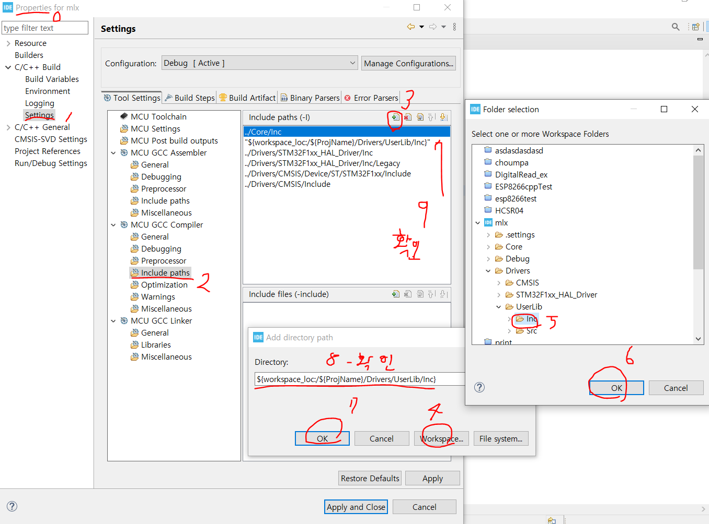

사용자 정의 라이브러리를 사용하기 위한 path를 설정해 주어야 합니다.

각 순서대로 진행하여 주십시오.

<br>

사진 6

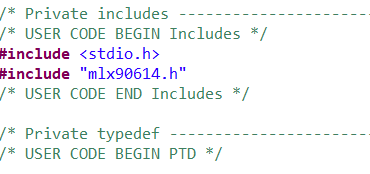

```c
/* USER CODE BEGIN Includes */
#include <stdio.h>
#include "mlx90614.h"
/* USER CODE END Includes */
```

```#include "mlx90614.h"```를 해줍니다.

여기서 같은 include인데 왜 <>와 ""를 구분하여 쓰냐면, <>는 원래 있는 header를 의미하고, ""는 사용자가 만든 header를 의미합니다.


<br><br><br>
### TODO 여기 좀더 작성해야함
<br><br><br>

<br>

사진 7

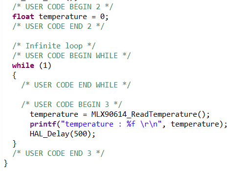

```c
  /* USER CODE BEGIN 2 */
  float temperature = 0;
  /* USER CODE END 2 */

  /* Infinite loop */
  /* USER CODE BEGIN WHILE */
  while (1)
  {
    /* USER CODE END WHILE */

    /* USER CODE BEGIN 3 */
	  temperature = MLX90614_ReadTemperature();
	  printf("temperature : %f \r\n", temperature);
	  HAL_Delay(500);
  }
  /* USER CODE END 3 */
```

마찬가지로 float를 printf()하려면 FPU가 없는 보드이므로 설정을 해주어야 합니다. 

모를 경우 [초음파 adv - 사진24]를 참고하여 주십시오.

<br>

사진 8

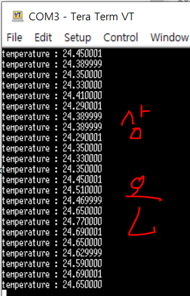

상온에서의 결과입니다.

<br>

사진 9

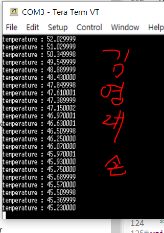

손을 접촉했을 때 결과입니다.

예상과 다르게 5cm 이내의 접촉이 이루어져야만 온도의 변화가 생겼습니다.

실제 시현시에는 거의 접촉하는 식으로 가야할 듯 합니다.

<br>


## 전자식 도어

Tilt와 동일하게 GPIO를 READ하는 방식이었음.
생략

## ESP 끝판왕

